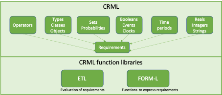

#	2. CRML architecture

The ability to write CRML models for the expression and simulation of requirements builds on two main parts:
*	The CRML language itself.
*	Two CRML libraries:
  *	The ETL library for the evaluation of requirements, whose purpose is to decide whether requirements are satisfied or not over a given time period.
  *	The FORM-L library that provides standard functions (CRML operators) for the expression of requirements in the form of time-dependent constraints. This library is inspired by the work of Thuy Nguyen of EDF Lab Chatou.

The CRML language is divided into several chapters, each chapter corresponding to a language type.

*Fig. 6. CRML architecture*
