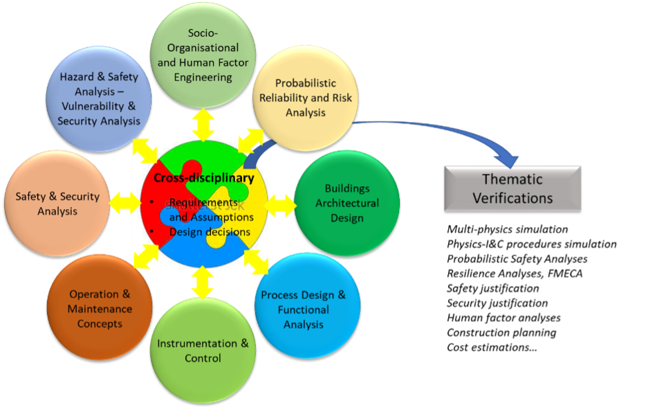

# Rationale for CRML
Motivation
It is important to ensure that complex cyber-physical systems such as energy systems comply with their objectives and constraints, because they are systems of important socio-economic nature for the common good. 

The acronym of CRML stands for Common Requirement Modelling Language.

The purpose of CRML is to offer to the numerous stakeholders involved in the design, operation and maintenance of cyber-physical systems a common language to negotiate and agree upon a common set of requirements in order to ensure that they can comply with their mutual commitments while meeting their own objectives. 

The idea is to write the requirements using a formal language to provide a solution to following challenges:

Provide comprehensive descriptions of all spatiotemporal assumptions and constraints that bear on the system under study. Constraints can be of all kinds: physical, performance (reliability, availability, economical…), regulatory (safety, security, environmental, reserve capacity for grid balancing, grid access and priority dispatch…).

The requirement models must be easily legible and understandable by all stakeholders whatever their expertise and business domain. It is expected that a common requirement language will improve the productivity of studies. To that end, the syntax of the language must be close to natural language.

*Fig. 1. Some stakeholders’ disciplines* 

	The systems which are the targets of the language exhibit strong physical aspects. Therefore, particular attention must be paid to physical aspects: physical units, real time, events, synchronism and asynchronism, components and objects, failures and uncertainties. Time dependent continuous and discrete variables must be dealt with in an asynchronous framework. This goes well beyond finite automata that are the reference in model checking.
	Perform automatic verifications by coupling requirement models with behavioral models of any kind and complexity: min and max limits (that represent authorized operation domains), finite state automata (that represent logical system operation), multidomain physical 0D/1D/2D/3D models (that represent detailed physical behavior), … Verifications are performed by co-simulating requirement models with behavioral models. Requirement models act as observers to detect possible requirement violations of the behavioral models. 
Behavioral models can be deterministic or stochastic. For the latter, probabilistic criteria are added to requirements and Monte Carlo techniques are used to simulate the verification model, which consists of the requirement model, the behavioral models, the observers of the behavioral models, and the links between observers and requirements which are called “bindings” (cf. Fig. 2). 
	Generate automatically optimal architectures that comply with the requirements (constraint optimization, the constraints being given by the requirement model, and the cost function corresponding in general to economic objectives). This remains a largely unexplored aspect (at least for energy systems) and should be useful to tackle the new system architectures for the energy transition (energy mix with higher shares of renewables, complex energy markets, increased environmental constraints, decentralized grid architectures…).

 
Fig. 2. Architecture of the verification model
Basic principles
Structure of the requirements
The language introduces the new concept of requirement made of four parts:
	Spatial locator (WHERE): it defines the objects that are subject to the requirement. The word “spatial” means that the objects are selected depending on some criteria that can be time dependent.
	Time locator (WHEN): it defines the time periods when the requirements should be satisfied. A time period is initiated and terminated when events occur. An event occurs when a Boolean becomes true. Therefore, a time locator can be composed of multiple time periods that can overlap.
	Condition to be fulfilled (WHAT): it is the condition to be verified by the objects selected with the spatial locator within the bounds of the time periods selected by the time locator.
	Probabilistic constraint (HOW_WELL): it defines a probabilistic constraint on the condition to be fulfilled. 
Time periods and probabilistic constraints constitute the novelty of the approach. They are required to handle realistic requirements, because realistic requirements cannot be satisfied anytime at any cost. Time periods define when requirements are in effect and the time delay to satisfy them. Probabilistic constraints define some tolerance for the system to fail complying with the requirements. These two aspects have profound technical and economic impact on the design and operation of the system.
Example of a requirement: “While in service, the system should always stay within its operating domain. However, if the system fails to stay within its operating domain, it should not stay outside of its operating domain for more than ten minutes more than three times per year, with a probability of success of 99.99 %.” 
In this requirement, three time locators and two conditions are involved. The three time locators are: a fixed time period “while the system is in service”, time periods of ten minutes starting when the event “leaving the operating domain” occurs, and a sliding time period of one year starting when the system is started and finishing when the system is stopped. The two conditions are “stay within the operating domain”, and “number of operating domain departures less than three”. The probabilistic constraint is the constant 99.99 %. However, it could depend on time for, e.g., requirements invoking probabilities of failure that use the Weibull law. The spatial locator is “the system”.
It turns out that this requirement is in fact a combination of three elementary requirements that are related by Boolean conjunction (∧) and inference (⟹) operators. It is therefore important to be able to combine requirements using Boolean operators. Also, a distinction must be made between the elementary requirements and the full requirement: the elementary requirements can fail, but the full requirement must be satisfied.
Example of a requirement: “While they are in operation, all pumps in the system should not cavitate.”
In this requirement, the spatial locator is “all pumps in the system”. It is a set that is only defined in intention, because its elements are only known by their property of being pumps. Therefore, the number of elements of the set is not known. The set could even be empty. The time locator is “While they are in operation”, which is attached to each pump because pumps can be operating at different time periods. The condition is “should not cavitate”. This kind of requirement is generic because it applies to any system, even without pumps. It is therefore important to be able to build libraries of generic requirements that can be used on different systems and use the notion of objects to structure the requirements.
Mathematical foundation of the language
The language builds on four pillars of mathematics: Boolean algebra, set theory, function theory and probability theory. 

Boolean algebra
Boolean algebra is used to handle the time locators (WHEN) and the conditions to be fulfilled (WHAT). The idea is to use a Boolean algebra made of four values { true, false, undecided, undefined }. 
To understand the meaning of the 4-valued Boolean algebra, let us take the simple example of a project report that must be written before a given deadline. The time locator for this requirement is a time period that extends from the start of the project until the deadline which is often the end of the project. Therefore, the requirement is: “The project report must be completed before the end of the project”. Before the start of the project, the value of the requirement is undefined, which means that the requirement is not applicable. After the start of the project and before the end of the project, the value of the requirement is undecided which means that the requirement is applicable but its outcome is uncertain until either the report is completed before or at the end of the time period (thus before the deadline or just in time), in such case the requirement is satisfied and its value is true, or until the end of the time period, in such case the requirement is not satisfied and its value is false (the report is late or cancelled).
The three values { true, false, undecided } are necessary to compute the value of the requirement, taking into account the fact that the decision cannot be made instantly: one must wait either until the document is completed, or until the deadline to decide whether the requirement is satisfied or not. This event is called the decision event. The three values { true, false, undecided } constitute by themselves a Boolean algebra which is similar to the 3-valued Kleene logic, but with different semantics.
The value undefined is necessary to combine requirements using Boolean operators. When a requirement is outside of its time locator, it is not applicable. Therefore, if it is combined with a second requirement, at time periods outside of its time locator it should have no effect on the other requirement. As an illustrating example, let us consider the requirement “While they are in operation, all pumps in the system should not cavitate.” Obviously, when a given pump is not in operation, the fact that it cavitates or not should not affect the outcome of the requirement on the pumps that are in operation.
The production and evaluation of requirements builds on the 4-valued Boolean logic (cf. Fig. 3):
	An event occurs when a Boolean becomes true (whatever its past value is false, undecided, or undefined).
	Time periods open when an event occurs, and close when an event occurs (the closing event can be equal to or different from the opening event).
	Conditions are Boolean expressions.
	Requirements result from the association of conditions with multiple time periods.
	The value of a requirement is a Boolean. Therefore, a requirement can be mathematically seen as a function that associates a couple (condition, multiple time period) to a 4-valued Boolean. This is denoted (φ,P)⟶φ⊗P, where φ is the condition and P is the time locator that consists of multiple time periods (i.e., a set of time periods).
	The value of a requirement can be reused to form other events and other conditions, and hence other requirements.

 
Fig. 3. General architecture of requirements

Booleans have different types depending on their origin:
	2-valued Booleans { true, false } are the classical Booleans in general issued from the behavioral model that captures the behavior of the system under study.
	3-valued Booleans { true, false, undecided } can be produced by the behavioral model to represent classical Booleans with uncertainties. For instance, Fig. 4 represents an operating domain whose limits are known with uncertainties: if the operating point is within the uncertainty of the boundary, then its position is undecided, otherwise it is true (inside the domain) or false (outside of the domain). They also correspond to time periods with no delay between them, i.e. such that time periods cover the whole arrow of time.
 
Fig. 4. Operating domain with uncertainty on the boundary

	3-valued Booleans { true, false, undefined } correspond to the values of requirements such that their associated time periods have their opening and closing events equal (i.e. such that the duration of the time periods is zero, cf. Fig. 5). Then the value of such requirements can never be undecided, and consequently the decision is instantly made (the opening, decision and closing events are the same).

 
Fig. 5. Multiple time period with zero length single time periods

	4-valued Booleans { true, false, undecided, undefined } are always the result of the evaluation of requirements. Using such Booleans to build requirements allow to issue requirements on requirements (i.e., meta-requirements) such as “10 seconds after requirement R1 fails, requirement R2 must be satisfied”, where requirements R1 and R2 are not specified (i.e., are considered as dummy variables in the expression of the meta-requirement).

In limiting situations where the length of time periods and the delay between time periods go to zero, Boolean variables can only take the values true or false (because undecided can only be found strictly inside time periods, and undefined can only be found strictly outside time periods). Thus the 2-valued Boolean algebra { true, false } corresponds in continuous time to limiting unrealistic situations when decisions can be made instantly anytime.

Set theory
The CRML language consists of elements which belong to sets, which can also be set elements (but not all elements are sets). It is assumed that there exists a unique universal set that contains all sets.
Each element is a typed couple (variable, value), where variable stands for the name of the element, and value is the value of the element. The type of the element is the domain that it belongs to, a domain being the set of all elements of the same kind, such as real numbers, Booleans, class definitions, classes (a class contains all objects instances of that class), etc. 
Sets are therefore used to structure models as arrays of objects of different types and relations between objects, like in relational databases.

Function theory
CRML functions are very simple and are called operators. They are of the form y=f(x_1,…,x_n ), where y and x_1,…,x_n are language elements, as defined above. f is the name of the operator, and y is its value, which is computed by a unique expression that combines operators on x_1,…,x_n.
For instance, the Boolean disjunction x_1  or x_2 can be defined from the Boolean conjunction x_1  and x_2 and the Boolean negation  not x: x_1  or x_2 ∶= not (not x_1  and 〖not x〗_2 ) .
Operators could be recursive, but this is of no obvious use in the context of requirement modelling. 
Although x_1,…,x_n could be operators (like in λ-calculus), this is not required in CRML.
A requirement can be mathematically viewed as a function that associates the couple (condition, set of time periods) to its Boolean value. Therefore, the framework of λ-calculus could be more appropriate (at least theoretically) to handle requirements (because everything is function in λ-calculus), however this has not been investigated.
Syntax of the language
The ambition of CRML is to be close to natural language. This is obtained by replacing the usual functional notation y=f(x_1,…,x_n ) by generic (or boilerplate) sentences with words that represent the placeholders of the operator’s arguments.
For instance, for function n=count (C,P) that counts the number of events generated by a clock C within a given time period P, the CRML operator is defined as 
operator [ Integer ] count Clock C inside Period P = expr (C,P);
where [ Integer ] is the return type of the operator, and C and P are the two arguments of the operator of respective types Clock (a clock is a set of events) and Period (a period is a time period). The words count and inside represent the placeholders for the two arguments C and P. expr (C,P) denotes the expression that computes the value of the operator from C and P. Then the expression 
Integer n is count C inside P;
is equivalent to n=count (C,P).
