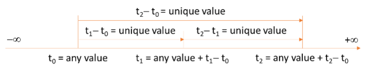

# 3. Formal semantics

## 3.1 Continuous clock

There is one continuous clock denoted $\mathfrak{C}$. It represents the Newtonian time. All time instants t in $\mathfrak{C}$  are real numbers: $t∈   \mathbb{R}$, where $\mathbb{R}$ is the domain of real numbers. Therefore, time has no upper or lower bounds. 

The time scale of $\mathfrak{C}$ depends on an arbitrary time origin $t_0$. Therefore, the value of $t_0$ can have any value (i.e., can be chosen arbitrarily). Only time differences (or delays) $t-t_0$  between any time instant t and the time origin $t_0$ have unique values (i.e., they cannot be chosen arbitrarily). It is customary to take $t_0=0$ so that $t=t-t_0$ has a unique value, but the choice of $t_0$ on the time axis is still arbitrary.

In the following figures, the continuous clock is represented by a continuous horizontal arrow.

*Fig. 7. The continuous clock*

In the sequel, all variables are functions of time $t∈\mathfrak{C}: x=x(t)$ where $x$ denotes any variable.

Let f be a function of several variables:

$$\begin{matrix} (f:  \mathbb{D}_1×\mathbb{D}_2×…×\mathbb{D}_n  ⟶ \mathbb{D} \\ 
  (x_1,x_2,…,x_n )   ⟼  y=f(x_1,x_2,…,x_n ) )  \end{matrix} $$

where the $\mathbb{D}_i$ and $\mathbb{D}$ stand of any domain. 

Unless specified otherwise, the values of all variables x_i are taken at the same instant $t∈\mathfrak{C}$.

## 3.2 4-valued Booleans

4-valued Booleans φ satisfy the following algebra:

$$ φ∶= φ | ¬φ |  φ_1∧ φ_2  $$ 

The logical negation (¬) and conjunction (ᴧ) operators are defined with the following truth tables:

Table 1. Truth table for the logical negation

|not	|Logical negation | | | |
| ----------- | ----------- |----------- | ----------- |----------- |
|$φ$	|true	|false	|undecided	|undefined |
|$¬φ$	|false|	true	|undecided	|undefined |

Table 2. Truth table for the logical conjunction

|and	|Logical conjunction | | | |
| ----------- | ----------- |----------- | ----------- |----------- |
|$φ_1∧ φ_2$	|true	|false	|undecided	|undefined|
|true	|true|	false|	undecided|	true|
|false|	false	|false	|false	|false|
|undecided|	undecided|	false|	undecided|	undecided|
|undefined|	true|	false|	undecided|	undefined|

The rationale for Table 1 and Table 2 is the following:
1. The truth table reduced to the values true and false are the same as the one for the classical 2-valued Booleans. 
2. $φ$ is undecided means that it not known whether $φ$ is true or false. Hence, if  $φ$ is undecided, then it is not known whether $¬φ$ is true or false, and therefore $¬φ$ is undecided. If $φ_1$ is undecided and $φ_2$ is true, then it is not known whether $φ_1∧ φ_2$ is true or false, because it is true if $φ_1$ is true, and false if $φ_1$ is false. Therefore $φ_1∧ φ_2$ is undecided. However, if $φ_2$ is false, then $φ_1∧ φ_2$ is false whatever the value of $φ_1$.
3. $φ$ is undefined means that $φ$ should not have any influence on the result of the Boolean operation because it is not applicable (cf. Section 1.2.2). Therefore, undefined is the neutral element for all Boolean operators.

The negation and conjunction operators verify the following properties of Boolean algebra:

* Involution: $∀φ,¬(¬φ)=φ $
*	Commutativity: $∀φ_1,∀φ_2,φ_1∧φ_2=φ_2∧φ_1$
*	Associativity: $∀φ_1,∀φ_2,(φ_1∧φ_2)∧φ_3=φ_1∧(φ_2∧φ_3)$
*	Idempotence: $∀φ,φ∧φ=φ$

But the following property is not verified:
* Contradiction: $∀φ,φ∧¬φ=false$

All other logical operators are defined using the Morgan laws:

* Logical disjunction:
	$$φ_1∨ φ_2 ∶= ¬(¬φ_1∧ 〖¬φ〗_2 )$$	
* Logical exclusive disjunction (or parity):
	$$φ_1⊕ φ_2 ∶= (φ_1∧ ¬φ_2 )∨(¬φ_1∧ φ_2 )$$	
* Logical inference:
	$$φ_1⟹ φ_(2 ) ∶=¬φ_1∨ φ_2$$	

It is easy to verify that the operators defined with the Morgan laws make sense considering the meaning given to undecided and undefined. For instance, for the logical disjunction, the truth table obtained using Eq. (2) and the truth table obtained using the rationale given for the logical conjunction operator are equal, cf. Table 3. 

Table 3. Truth table for the logical disjunction
or	Logical disjunction
φ_1∨ φ_2	true	false	undecided	undefined
true	true	true	true	true
false	true	false	undecided	false
undecided	true	undecided	undecided	undecided
undefined	true	false	undecided	undefined

For clarity, the truth table of the equality operator (=) is given in the following table.

Table 4. Truth table for the logical equality
equal	Logical equality
φ_1= φ_2	true	false	undecided	undefined
true	true	false	false	false
false	false	true	false	false
undecided	false	false	true	false
undefined	false	false	false	true

The logical difference operator is defined as
	φ_1≠ φ_2 ∶=  〖¬(φ〗_1= φ_2)  	(5)

Contrary to 2-valued Boolean algebra, in the 4-valued Boolean algebra, the negation operator is different from the difference operator: φ_1≠φ_2 does not imply φ_1=〖¬φ〗_2 and reciprocally. Therefore, one must be cautious not to confound negation with difference when using 4-valued Boolean algebra.

The domain of 4-valued Booleans { true, false, undecided, undefined } is denoted B or B_4.
The domain of 2-valued Booleans { true, false } is denoted  B_2.
It is worthwhile noting that the two domains of 3-valued Booleans { true, false, undecided } and { true, false, undefined } are indeed Boolean algebras (they satisfy the Morgan laws). They are respectively denoted B_3 and B_3^'.
Thus:
	B=B_4={true,false,undecided,undefined}
	B_3={true,false,undecided}
	B_3^'={true,false,undefined}
	B_2={true,false}
Events
An event E corresponds to the single occurrence of a 4-valued Boolean φ becoming true, which is denoted φ↑:
	E ∶=  φ↑ 	(6)

Notice that before the event, the value of φ can be false, undecided or undefined.
Events always occur in the continuous time domain C. 

The instant t of occurrence of event φ↑ is denoted @φ↑:
	t∶= @φ↑	(7)
where t is the instant of occurrence of φ↑.

The event that corresponds to the current time t∈C is denoted C↑. Therefore t=@C↑.

The event corresponding to the current instant in the continuous clock C is denoted C↑. Therefore, the current instant is t=@C↑. 

 
Fig. 8. Event generated by a Boolean

The domain of events is denoted E. 
At instant time t, E contains all events that have occurred before t, including t. It does not contain future events that will occur after t excluding t because it is not decidable at t whether future events will actually occur. Therefore, the domain of events E is time dependent and the number of its elements increases in time as the number of occurred events increases in time. Before the occurrence of the first event, E is the empty set.
The domain of non-empty events is denoted E^*. Therefore E^* always contains the first event.
	{■( |E|≥0  @  |E^* |>0)┤	(8)
where |S| denotes the number of elements in set S.

E^* is an ordered set because the events in E are ordered by increasing occurrences in time:
	E^* (t) ∶=  {〖 φ〗_1↑,φ_2↑,…,φ_i↑,…,φ_n↑ }   such that ∀i,∀j>i,〖@φ〗_i↑  ≤@φ_j↑  	(9)
where the φ_i↑ are all the events that have occurred before t.  

Because φ_n↑ is the last event in E^* (t), the following relation holds:
	E^* (t)  = E^* (φ_n↑)  	(10)
where E^* (φ_n↑) denotes the value of E^* at the instant of occurrence of φ_n↑ (E^* (φ_n↑)=E^* (@φ_n↑)). .

Therefore
	E^* (φ_n↑)  ∶=  {〖 φ〗_1↑,φ_2↑,…,φ_i↑,…,φ_n↑ }   such that ∀i,∀j>i,〖@φ〗_i↑  ≤ 〖@φ〗_j↑  	(11)

Hence:
	φ_i↑ occurs before φ_j↑ can be formally expressed as φ_j↑ 〖∉E〗^* (φ_i↑) if it is not known whether φ_j will occur or not, or φ_i↑ 〖∈E〗^* (φ_j↑) or 〖@φ〗_i↑  ≤ 〖@φ〗_j↑  if φ_j has occurred.
	〖E^*=E〗^* (φ_|E^* | ↑).

The set of events obtained after the disjunction of two events 〖 φ〗_1↑ and 〖 φ〗_2↑ (i.e., after at least one of the events 〖 φ〗_1↑ or 〖 φ〗_2↑ has occurred) is denoted E^* (φ_1↑  ∨ φ_2↑). Therefore:
	E^* (φ_1↑  ∨ φ_2↑) ∶=  {█(E^* (φ_1↑)  if 〖 φ〗_2↑ 〖∉E〗^* (φ_1↑) @E^* (φ_2↑)  if 〖 φ〗_1↑ 〖∉E〗^* (φ_2↑) )┤   	(12)

The set of events obtained after the conjunction of two events 〖 φ〗_1↑ and 〖 φ〗_2↑ (i.e., after the two events 〖 φ〗_1↑ and 〖 φ〗_2↑ have occurred) is denoted E^* (φ_1↑  ∧〖 φ〗_2↑). Therefore:
	E^* (φ_1↑  ∧〖 φ〗_2↑) ∶=  {█(E^* (φ_1↑)  if 〖 φ〗_2↑ 〖∈E〗^* (φ_1↑) @E^* (φ_2↑)  if 〖 φ〗_1↑ 〖∈E〗^* (φ_2↑) )┤   	(13)
Multiple events
A multiple event Ω is a subset of E: Ω∈2^E.
It is therefore a set of events ordered by increasing occurrences in time:
	Ω ∶=  { φ_1↑,φ_2↑,…,φ_i↑,…}   such that ∀i,∀j>i,〖@φ〗_i↑  ≤ 〖@φ〗_j↑  	(14)

Let us consider a Boolean ψ that becomes true at each event φ_i↑ (there are infinitely many of such Booleans).  Then Ω is generated by ψ. This is denoted Ω(ψ):
	Ω(ψ) ∶=  { ψ(t_1)↑,ψ(t_2)↑,…,ψ(t_i)↑,…}  	(15)
Where the t_i=@φ_i↑ are the time instants when ψ becomes true (i.e., such that  ψ(t_i )↑  =〖 φ〗_i↑) for all i∈N^*,1≤i≤|Ω(ψ)|.

The chosen Boolean ψ that generates Ω(ψ) is denoted ψ(Ω).

Note that the number of elements |Ω(ψ)| is time dependent as the set Ω(ψ) increases in time like any subset of E:
	|Ω(ψ)|   = {█(0  if  t<t_1@ i  if  i≤t<i+1)┤     	(16)

 
Fig. 9. Multiple event generated by a Boolean

The domain of multiple events is denoted D. Then D=2^E (the set of the subsets of E).
Operators on events
Equal operator
The equal operator tells whether two events φ_1↑ and φ_2↑ are equal, i.e. whether they occur at the same time instant. It is formally defined as follows:
	■(=:  E ×  E⟶  B @〖(φ〗_1↑,φ_2↑)⟼φ_1↑ = φ_2↑  ∶= {█(█(true   if  φ_2↑ ∈ E^* (φ_1↑)  ∧   φ_1↑ ∈ E^* (φ_2↑)@false  if  〖¬(φ〗_2↑ ∈ E^* (φ_1↑)  ∧   φ_1↑ ∈ E^* (φ_2↑)))@undecided if φ_1↑  ∉ E and φ_2↑  ∉ E )┤  )	(17)

Eq. (17) means that φ_1↑ = φ_2↑ is true  if φ_1↑  and φ_2↑ occur at the same time instant. It is undecided if none of the two events φ_1↑ or φ_2↑ occurs. It is false otherwise. Therefore, the value of φ_1↑ = φ_2↑ is always known, even if φ_1↑ and/or φ_2↑ have not occurred.
Also notice that φ_1↑ = φ_2↑  does not imply that φ_1  = φ_2   (but the converse is true, cf. Fig. 10).

 
Fig. 10. Event equal operator
Different operator
The different operator tells whether two events φ_1↑ and φ_2↑ are different, i.e. whether they occur at different time instants. It is formally defined as follows:
	■(≠:  E ×  E⟶  B @〖(φ〗_1↑,φ_2↑)⟼φ_1↑ ≠ φ_2↑  ∶= 〖¬(φ〗_1↑ = φ_2↑) )	(18)

The value of φ_1↑ ≠ φ_2↑ is always known, even if φ_1↑ and/or φ_2↑ have not occurred.
Notice that Eq. (18) is consistent with the definition of the different operator from first principles:
φ_1↑ ≠ φ_2↑  ∶=   {█(█(true   if  〖¬(φ〗_2↑ ∈ E^* (φ_1↑)  ∧   φ_1↑ ∈ E^* (φ_2↑))@false  if  φ_2↑ ∈ E^* (φ_1↑)  ∧   φ_1↑ ∈ E^* (φ_2↑) )@undecided if φ_1↑  ∉ E and φ_2↑  ∉ E )┤)
Before operator 
The before operator tells whether a first event φ_1↑ occurs before a second event φ_2↑. It is formally defined as follows:
	■(≤:  E ×  E⟶  B @〖(φ〗_1↑,φ_2↑)⟼φ_1↑ ≤ φ_2↑  ∶= {█(█(true   if  φ_2↑ ∉ E^* (φ_1↑)∨φ_1↑ = φ_2↑@false  if  φ_1↑ ∉ E^* (φ_2↑)  )@undecided if φ_1↑  ∉ E and φ_2↑  ∉ E )┤  )	(19)

Eq. (19) means that φ_1↑ ≤ φ_2↑ is:
	undecided if neither φ_1↑ nor φ_2↑ have occurred,
	true if φ_1↑ has occurred first, or if φ_1↑ and φ_2↑ occur simultaneously,
	false if φ_2↑ has occurred first.
Therefore, the value of φ_1↑ ≤ φ_2↑ is always known, even if φ_1↑ and/or φ_2↑ have not occurred.

The strictly before operator is defined as follows:
	■(<:  E ×  E⟶  B @〖(φ〗_1↑,φ_2↑)⟼φ_1↑ < φ_2↑  ∶= 〖(φ〗_1↑ ≤ φ_2↑) ∧  〖(φ〗_1↑ ≠ φ_2↑))	(20)

The value of φ_1↑ < φ_2↑ is always known, even if φ_1↑ and/or φ_2↑ have not occurred.

 
Fig. 11. Event before operator
After operator 
The after operator tells whether a first event φ_1↑ occurs after a second event φ_2↑. It is formally defined as follows:
	■(≥:  E ×  E⟶  B @〖(φ〗_1↑,φ_2↑)⟼φ_1↑ ≥ φ_2↑  ∶= φ_2↑ ≤ φ_1↑ )	(21)

Notice that Eq. (21) is consistent with the definition of the after operator from first principles:
■(≥:  E ×  E⟶  B @〖(φ〗_1↑,φ_2↑)⟼φ_1↑ ≥ φ_2↑  ∶= {█(█(true   if  φ_1↑ ∉ E^* (φ_2↑)∨φ_2↑ = φ_1↑@false  if  φ_2↑ ∉ E^* (φ_1↑)  )@undecided if φ_1↑  ∉ E and φ_2↑  ∉ E )┤  )

Eq. (21) means that φ_1↑ ≥ φ_2↑ is:
	undecided if neither φ_1↑ nor φ_2↑ have occurred,
	true if φ_2↑ has occurred first or if φ_2↑ and φ_1↑ occur simultaneously,
	false if φ_1↑ has occurred first.
Therefore, the value of φ_1↑ ≥ φ_2↑ is always known, even if φ_1↑ and/or φ_2↑ have not occurred.

The strictly after operator is defined as follows:
	■(>:  E ×  E⟶  B @〖(φ〗_1↑,φ_2↑)⟼φ_1↑ > φ_2↑  ∶= φ_2↑ < φ_1↑)	(22)

The value of φ_1↑ > φ_2↑ is always known, even if φ_1↑ and/or φ_2↑ have not occurred.
 
Fig. 12. Event after operator
Min operator 
The min operator computes the first occurring event between two events φ_1↑ and φ_2↑, φ_2↑ occurring before or after φ_1↑. It is formally defined as follows:
	■(min:  E ×  E ⟶  2^E   @〖(φ〗_1↑,φ_2↑)⟼min⁡〖〖(φ〗_1↑,φ_2↑)〗 ∶={■({φ_1↑}   if  (〖φ_1↑ ≤φ〗_2↑)=true@{φ_2↑}   if  (φ_2↑ ≤φ_1↑)=true@∅ else)┤ )	(23)

Eq. (23) produces a multiple time event to cope with the possibility of non-occurrence of φ_1↑ and φ_2↑. 
Notice that Eq. (23) is consistent with the definition of the min operator from first principles:
min⁡〖〖(φ〗_1↑,φ_2↑)〗   ∶=   {■( {φ_1↑}  if  φ_2↑ ∉ E^* (φ_1↑)  ∨ φ_1↑ = φ_2↑ @{φ_2↑}  if  φ_1↑ ∉ E^* (φ_2↑)  ∨φ_2↑ = φ_1↑@∅  else)┤
 
Fig. 13. Event min operator
Max operator 
The max operator computes the last occurring event between two events φ_1↑ and φ_2↑, φ_2↑ occurring before or after φ_1↑. It is formally defined as follows:
	■(max: E ×  E ⟶  2^E  @〖(φ〗_1↑,φ_2↑)⟼max⁡〖〖(φ〗_1↑,φ_2↑)〗 ∶={█({φ_1↑}  if  φ_2↑ ∈E^* (φ_1↑)@{φ_2↑}  if  φ_1↑ ∈E^* (φ_2↑)@∅  else)┤ )	(24)

Eq. (24) produces a multiple time event to cope with the possibility of non-occurrence of φ_1↑ and φ_2↑. 
Notice that the following definition is not correct because φ_1↑ and φ_2↑ must have occurred to provide a non-empty value for max⁡〖〖(φ〗_1↑,φ_2↑)〗:
max⁡〖〖(φ〗_1↑,φ_2↑)〗   ∶≠   {{█({φ_1↑}  if  〖φ_1↑ ≥φ〗_2↑@{〖 φ〗_2↑}  if  φ_2↑ ≥φ_1↑@∅  else)┤┤  

 
Fig. 14. Event max operator
Elapsed operator 
The elapsed operator computes the elapsed time between two events φ_1↑ and φ_2↑, φ_2↑ occurring after φ_1↑, which means that φ_1↑ ∈ E^* (φ_2↑). It is denoted -:
	■(〖-∶ E〗^* (φ_2↑)×  E^* (φ_2↑)⟶  R^+   such that 〖φ_2↑ ≥φ〗_1↑ @〖〖(φ〗_1↑,φ_2↑) ⟼φ〗_2↑-  φ_1↑ = d)	(25)
where d∈R^+. d is the elapsed time, or delay between φ_1↑ and φ_2↑. The value of  φ_2↑- φ_1↑ is not known until E^* (φ_2↑)  exists, i.e. until the second event φ_2↑ has occurred.

Notice that Eq. (25) is consistent with Eq. (17), (19) and (20), but not equivalent since they have different definition domains:
〖φ_1↑-  φ_2↑ =0 ⟺  φ〗_1↑ = φ_2↑ 
φ_2↑-  φ_1↑ ≥0 ⟺ φ_2↑ ≥φ_1↑
φ_2↑-  φ_1↑ >0 ⟺ φ_2↑ >φ_1↑

If φ_1↑ occurs at time t_1 and φ_2↑  occurs at time t_2, then the elapsed time between the two events is given by〖 φ〗_2↑-〖 φ〗_1↑. 
	t_2-t_1=@φ_2↑-〖 @φ〗_1↑ =〖 φ〗_2↑-〖 φ〗_1↑ 	(26)

 
Fig. 15. Event elapsed operator
Delay operator
The delay operator applied on event φ_1↑ generates a second event φ_2↑=φ_1↑+ d after φ_1↑ where d∈R^+ is the delay between φ_1↑ and φ_2↑. It is formally defined as follows:
	■(+:  E×R^+   ⟶  2^E  @(φ_1↑,d)  ⟼ φ_1↑+ d ∶={φ_2↑such that @φ_2↑ =@φ_1↑+ d }  )  	(27)

Therefore φ_1↑+ d is the empty set as long as φ_1↑+ d has not occurred, and a set that contains one event when φ_1↑+ d has occurred.
Notice that Eq. (27) is consistent with Eq. (25) because:
〖@φ〗_2↑   = 〖@φ〗_1↑+ d ⟺  φ_2↑-  φ_1↑  = d 

 
Fig. 16. Event delay operator
Conjunction operator
The conjunction operator ∧ applied on two events φ_1↑ and φ_2↑ generates the event φ↑ =φ_1↑ =φ_2↑  if φ_1↑ and φ_2↑ occur at the same instant in time. It is formally defined as follows:
	■(∧:  E×E⟶  2^E  @〖(φ〗_1↑,φ_2↑) ⟼φ_1↑  ∧ φ_2↑ ≔{ φ↑such that φ↑ =φ_1↑ =φ_2↑ }  )	(28)

Therefore φ_1↑  ∧ φ_2↑  is the empty set if φ_1↑ or φ_2↑ have not occurred, or if φ_1↑ ≠φ_2↑, and a set that contains the event φ_1↑ if  φ_1↑ has occurred and φ_1↑ =φ_2↑. 
The conjunction operator ∧ applied on an event φ↑ and a multiple event Ω yields a multiple event { φ↑ }    if φ↑ is an event of Ω. It is formally defined as follows:
	■(E×D⟶  D @(φ↑,Ω) ⟼φ↑  ∧ Ω ≔{φ↑}∩Ω )	(29)
 Disjunction operator
The disjunction operator ∨ applied on two events φ_1↑ and φ_2↑ yields a multiple event Ω that contains the two events φ_1↑ and φ_2↑. It is formally defined as follows:
	■(∨:  E×E⟶  D @〖(φ〗_1↑,φ_2↑) ⟼φ_1↑  ∨ φ_2↑ ≔{ φ_1↑,φ_2↑ }  )	(30)

Therefore φ_1↑  ∨ φ_2↑  is the empty set if φ_1↑ and φ_2↑ have not occurred, and a set that contains the event φ_1↑ if  φ_1↑ has occurred and the event φ_2↑ if  φ_2↑ has occurred. 
The disjunction operator ∨ applied on an event φ↑ and a multiple event Ω yields a multiple event Φ that contains φ↑ and the events of Ω. It is formally defined as follows:
	■(E×D⟶  D @(φ↑,Ω)⟼φ↑  ∨ Ω ≔{φ↑}∪Ω )	(31)
 Composition of Booleans with events
A Boolean φ can be composed with and event ψ↑ as follows:
	■(op:  B×E⟶  B @(φ,ψ↑)⟼φ  op  ψ↑ ∶= φ  op {█(true if t=@ψ↑@undefined if t≠@ψ↑)┤   )	(32)
where op denotes the binary logical operators ∧ or ∨.

A Boolean φ can be composed with a multiple event Ω as follows:
	■(op:  B×D⟶  B @(φ,Ω)⟼φ  op  Ω ∶=((φ  op Ω^1 )  op Ω^2 )… op Ω^|Ω|    )	(33)
where op denotes the binary logical operators ∧ or ∨.

 
Fig. 17. Composition of Booleans with events
Discrete clocks
A discrete clock Ω is a multiple event Ω. Therefore, the terms ‘discrete clock’ and ‘multiple event’ are synonymous.
It is therefore a set of events ordered by increasing occurrences in time:
	Ω ∶=  { φ_1↑,φ_2↑,…,φ_i↑,…}   such that ∀i,∀j>i,〖@φ〗_i↑  ≤ 〖@φ〗_j↑  	(34)

The φ_i↑ in Eq. (34) are called the clock ticks. The rank of the clock tick φ_i↑ in Ω is denoted rank(φ_i↑ ∈Ω).

Let us consider a Boolean ψ that becomes true at each event φ_i↑ (e.g., ψ=false∨Ω).  Then Ω is generated by ψ. This is denoted Ω(ψ):
	Ω(ψ) ∶=  { ψ(t_1)↑,ψ(t_2)↑,…,ψ(t_i)↑,…}  	(35)
where the t_i=@φ_i↑ are the time instants when ψ becomes true (i.e., such that  ψ(t_i )↑  =〖 φ〗_i↑) for all i∈N^*,1≤i≤|Ω(ψ)|. When no confusion is possible between clocks and events, it is also possible to write  Ω(ψ)=ψ↑.

The chosen Boolean ψ that generates Ω(ψ) is denoted ψ(Ω). If the clock Ω(ψ) is written Ω(ψ)=ψ↑, then ψ(Ω)=ψ.
Note that Ω(false)=∅, which can be denoted false↑ =∅.

The discrete time associated to a discrete clock is given by the sequence number i of the clock tick, but each clock tick is associated with its time occurrence in the continuous clock domain. The ith tick of clock Ω is denoted Ω^i=ψ(t_i)↑. It is occurring at discrete time i∈N^* in the discrete clock domain Ω and at continuous time t_i∈R in the continuous clock domain C.
	Ω(ψ) ∶=  { Ω^1,Ω^2,…,Ω^i,…}  	(36)
where Ω^i= ψ(t_i)↑ for all i∈N^*,1≤i≤|Ω(ψ)|. 

If the notation ψ↑ is used to denote clock Ω(ψ), then Ω^i=(ψ↑)^i. Then the event ψ↑ can be considered as the first tick of clock ψ↑:
	ψ↑  ≡  (ψ↑)^1  	(37)

The rank function is defined as:
	■(rank:  Ω⟶ N @  Ω^i⟼ rank(Ω^i )=i)	(38)

The discrete time associated to clock Ω is given by the number of ticks |Ω| of Ω. |Ω| increases in time by one unit at each new tick Ω^|Ω| . Ω^|Ω|  is thus called the current tick of clock Ω. |Ω|=0 before the first tick (the set Ω is empty). The discrete time associated to Ω is not defined when Ω is empty because when |Ω|=0, Ω^|Ω|  is not defined (Ω^i is defined for i≥1).
	|Ω|   = {█(0  if  t<@Ω^1@ i  if  @Ω^i≤t<@Ω^(i+1) )┤     	(39)
where @Ω^i denotes the instant of occurrence of tick Ω^i.

Ω(i) denotes the value of Ω at instant 〖@Ω〗^i:
	Ω(i) ∶=  Ω(Ω^i )={  Ω^1,Ω^2,…,Ω^i  }  	(40)

Therefore, Ω≠∅⟹Ω=Ω(|Ω|).

 
Fig. 18. Discrete clock generated by a Boolean

The domain of discrete clocks is denoted D. Then D=2^E (the set of the subsets of E).
The set of the subsets of E(φ↑) is denoted D(φ↑): 〖D(φ↑)=2〗^(E(φ↑)). 
Operators on discrete clocks
Projection operator 
The projection (φ↑)⁄Ω of an event φ↑ on a discrete clock Ω is the first tick of Ω that follows φ↑. It is formally defined as follows:
	■( ⁄∶  E×D⟶  D @(φ↑,Ω)  ⟼ (φ↑)⁄Ω  ≔ {█( {〖 Ω〗^i=min┬(j≥i)⁡(Ω^j≥φ↑)  if  ∃k such that Ω^k≥ φ↑ }@∅  if  ∄k such that Ω^k≥ φ↑)┤ )	(41)

The projection operator Ω_1⁄Ω_2  of a discrete clock Ω_1 on a discrete clock Ω_2 is defined as follows:
	■( ⁄∶  D×D⟶ D @〖(Ω〗_1,Ω_2)  ⟼ Ω_1⁄Ω_2  ∶= ⋃_(i=1)^|Ω_1 |▒(Ω_1^i)⁄Ω_2 )	(42)

 
Fig. 19. Discrete clock projection operator

The projection t⁄Ω of a time instant t∈C on a discrete clock Ω is the first tick of Ω that follows t. It is formally defined as follows:
	■( ⁄∶   E×D⟶  D @(t,Ω)  ⟼ t⁄Ω  ≔ {█( {〖 Ω〗^i=min┬(j≥i)⁡(〖@Ω〗^j≥t)  if  ∃k such that 〖@Ω〗^k≥ t }@∅  if  ∄k such that @Ω^k≥ t)┤ )	(43)

It follows from this definition that the projection of the continuous clock C on a discrete clock Ω and that the projection of a discrete clock Ω on the continuous clock C are the discrete clock Ω itself:
	C⁄(Ω )=Ω  	(44)
	Ω⁄(C )=Ω  	(45)

 
Fig. 20. Continuous clock projection operator on a discrete clock
Bounded projection operator 
The bounded projection (φ↑)⁄( ^d Ω) of an event φ↑ on a discrete clock Ω is the first tick of Ω that follows φ↑ if it is delayed by at most d∈R^+ from φ↑. Otherwise, the projection is lost. It is formally defined as follows:
	■(〖/ 〗^d ∶  E×D×R^+⟶  D @(φ↑,Ω,d)  ⟼ (φ↑)⁄( ^d Ω)  ≔ {█( {〖 Ω〗^i=min┬(j≥i)⁡(φ↑+ d≥Ω^j≥φ↑)  if  ∃k such that φ↑+ d≥Ω^k≥ φ↑ }@∅  if  ∄k such that 〖φ↑+ d≥Ω〗^k≥ φ↑)┤ )	(46)

The projection operator Ω_1⁄( ^d Ω_2 ) of a discrete clock Ω_1 on a discrete clock Ω_2 is defined as follows:
	■(〖/ 〗^d ∶  D×D⟶ D @〖(Ω〗_1,Ω_2)  ⟼ Ω_1⁄( ^d Ω_2 ) ∶= ⋃_(i=1)^|Ω_1 |▒(Ω_1^i)⁄( ^d Ω_2 ))	(47)

 
Fig. 21. Discrete clock bounded projection operator

The bounded projection t⁄( ^d Ω) of a time instant t∈C on a discrete clock Ω is the first tick of Ω that follows t if it is delayed by at most d∈C from t. Otherwise, the projection is lost. It is formally defined as follows:
	■(/ ∶   E×D×R^+⟶  D @(t,Ω,d)  ⟼ t⁄( ^d Ω)   ≔ {█( {〖 Ω〗^i=min┬(j≥i)⁡(t+ d≥〖@Ω〗^j≥t)  if  ∃k such that t+ d≥〖@Ω〗^k≥ t }@∅  if  ∄k such that t+ d≥@Ω^k≥ t)┤ )	(48)

 
Fig. 22. Continuous clock bounded projection operator on a discrete clock

Note that d is a function of time (it is not a fixed quantity).
Delay operator
The delay operator denoted + applied on tick Ω^i of clock Ω delays Ω^i by n ticks. It is formally defined as follows:
	■(+:  Ω×N⟶  Ω @〖(Ω〗^i,n)⟼ Ω^i+n ∶= Ω^(i+n) )	(49)
where n∈N is the delay expressed in number of ticks of Ω.

Note that tick Ω^(i+n) can never occur.

 
Fig. 23. Clock tick delay operator 

The delay operator denoted + applied on clock Ω_1 (Ω_1^i ) generates a second clock Ω_2 whose ticks are   delayed by n ticks of Ω_1. It is formally defined as follows:
	■(+:  D×N⟶  D @(Ω_1 (Ω_1^i ),n)⟼Ω_2=Ω_1+n≔ { Ω_1^j+n,   i≤j≤|Ω_1 |  } )	(50)
where n∈N is the delay expressed in number of ticks of Ω_1.

 
Fig. 24. Discrete clock delay operator
Elapsed operator 
The elapsed operator denoted - applied on two ticks Ω^i and Ω^j of clock Ω, Ω^j occurring after Ω^i, yields the elapsed time (or delay) between Ω^i and Ω^j. It is formally defined as follows:
	■(-:  Ω(Ω^i )× Ω(Ω^j )⟶ N such that j≥ i@〖(Ω〗^i,Ω^j)⟼ 〖Ω_j-Ω〗_i ∶=j-i)	(51)

 
Fig. 25. Discrete clock elapsed operator
Conjunction operator
The conjunction operator ∧ applied on two clocks Ω_1 and Ω_2 yields a third clock Ω that contains all ticks of Ω_1 and Ω_2 that are equal. It is formally defined as follows:
	■(∧:  D×D⟶  D @〖(Ω〗_1,Ω_2) ⟼〖Ω=Ω〗_1∧ Ω_2≔Ω_1∩〖 Ω〗_2  )	(52)

 
Fig. 26. Discrete clock conjunction operator
Disjunction operator
The disjunction operator ∨ applied on two clocks Ω_1 and Ω_2 yields a third clock Ω that contains all ticks of Ω_1 and Ω_2. It is formally defined as follows:
	■(∨:  D×D⟶  D @〖(Ω〗_1,Ω_2) ⟼〖Ω=Ω〗_1∨ Ω_2≔Ω_1∪〖 Ω〗_2  )	(53)

 
Fig. 27. Discrete clock disjunction operator
Filter operator 
The filter operator applied on clock Ω filters (i.e., removes) all ticks that do not satisfy a Boolean condition. It is formally defined as follows:
	■(filter:  D×O(Ω⟶B)⟶  D @〖(Ω〗_1,cond)⟼Ω_2=Ω_1 (cond(*))≔ {〖 Ω〗_(1 )^i∈Ω_1  such that cond(〖 Ω〗_(1 )^i )=true } )	(54)
where * denotes a dummy variable that represent any element 〖 Ω〗_(1 )^i∈ Ω_1, and cond is a Boolean condition on 〖 Ω〗_(1 )^i.

 
Fig. 28. Discrete clock filter operator
Extending operators on a discrete clock to the continuous time domain
To be simulated, operators defined on a discrete clock must be extended to the continuous time domain C.
Let f(Ω) be a function that takes the clock Ω as argument:
	■(f: D  ⟶   D@    Ω  ⟼ f(Ω) )	(55)
where D can be any domain.

The extension f ̅ of f to the continuous time domain C is defined as follows:
	■([ @Ω^1,+ ┤[   ⟶   D@    t ⟼ f ̅(t)={█(f(Ω^i )   for  @Ω^i≤t<@Ω^(i+1)   if 1≤i<|Ω|@f(Ω^|Ω|  )   for  t≥@|Ω| )┤  )	(56)

The definition given by Eq. (56) can be extended to functions f(Ω_1,…,Ω_i,…,Ω_n ) defined on multiple clocks Ω_1,…Ω_i,…Ω_n as follows:
	■([ @Ω_1^1,+ ┤[×…× [ @Ω_i^1,+ ┤[×… ×[ @Ω_n^1,+ ┤[   ⟶   D@    (t_1,…t_i,…t_n )  ⟼ f ̅(t_1,…t_i,…t_n )=f(Ω_1^(j_1 ),…,Ω_i^(j_i ),…,Ω_n^(j_n ) )   for  @Ω_i^(j_i )≤t<@Ω_i^(j_i+1)  )	(57)	
with the convention that @Ω_i^(j_i+1)=+ if j_i=|Ω_i |. Note that f ̅ is undefined until all clocks have their first tick.
 
Fig. 29. Extending operators on discrete clocks to the continuous time domain
Single time periods
A single time period P is a time interval between two events φ_1↑ and φ_2↑. The left and right boundaries can be included or excluded (this is indicated by the notation [ | ]).  
	P ∶=  [ | ] φ_1↑,φ_2↑ [ | ]	(58)

φ_1↑ is called the opening event. It is denoted P↑.
φ_2↑ is called the closing event. It is denoted P↓.

Therefore, Eq. (58) can be rewritten as follows:
	P ∶=  [ | ] P↑,P↓ [ | ]	(59)

The domain of single time periods is denoted P.

 
Fig. 30. Single time period
Multiple time periods
A multiple time period P is a set of single time periods P_i ordered by opening events increasing in time:
	P ∶=  { P_1,P_2,…,P_i,…}  such that ∀i,∀j,j>i ⇒P_j↑  ≥ P_i↑   	(60)

Multiple time periods P containing single time periods opened at all occurrences of φ_1↑ and closed at all occurrences of φ_2↑ are denoted
	P ∶=  Π([ ┤|  ]  φ_1↑,φ_2↑ [ ┤|  ])	(61)

 
Fig. 31. Multiple time period

The domain of multiple time periods is denoted 2^P.

A non-overlapping time period P is a multiple time period such that there is no time overlaps between the single time periods P_i of the multiple time period P. It is formally defined as follows:
	P ∶=  { P_1,P_2,…,P_i,…}    such that ∀i∈[1,|P|-1],P_i↓  < P_(i+1)↑   	(62)

The non-overlapping time period P(ψ) generated by the Boolean ψ is defined as:
	P(ψ) ∶=  Π([ ┤|  ]  ψ↑,ψ↓ [ ┤|  ])	(63)
where ψ↓ ∶= ¬ψ↑.

 
Fig. 32. Non-overlapping time period

 
Fig. 33. Reduced graphical representation of a non-overlapping time period

 
Fig. 34. Non-overlapping time period generated by a Boolean
Operators on multiple time periods
Intersection operator
The intersection operator between two single time periods P_1 and P_2 produces a multiple time period P that contains a single time period made of all time instants common to P_1 and P_2. It is formally defined as follows:
	■(∩:  P×P ⟶  2^P@    (P_1,P_2 )   ⟼ P= P_1∩P_2  ∶={█({[max⁡(P_1↑,P_2↑),min⁡(P_1↓,P_2↓)]}   if max⁡(P_1↑,P_2↑)≤min⁡(P_1↓,P_2↓)@∅  if max⁡(P_1↑,P_2↑)>min⁡(P_1↓,P_2↓))┤    )	(64)

〖 P〗_1∩P_2 is a multiple time period which can be empty or contains one single time period. Therefore:
	0≤|P_1∩P_2 |≤1	(65)
Truncation operator
The truncation operator between a non-overlapping multiple time period P_1={P_(1,i) }_(  1≤i≤|P_1 | ) and a multiple time period P_2={P_(1,j) }_(  1≤j≤|P_2 | ) produces a multiple time period P={P_k }_(  1≤k≤|P| ) such that all its single time periods P_k are the single time periods P_(2,j) of P_2 truncated by the single time periods P_(1,i) of P_1. It is formally defined as follows:
	■(⊃:  2^P×2^P  ⟶  2^P@    (P_1,P_2 )   ⟼ P= P_1⊃P_2  ∶= ⋃_(  1≤i≤|P_1 |,1≤j≤|P_2 |  )▒〖〖 P〗_(1,i)∩P_(2,j) 〗   )	(66)

From Eq. (66), in general:
	0≤|P_1⊃P_2 |≤|P_1 ||P_2 |	(67)

The non-overlapping time period P_1 such that P_1⊃P_2 is called the frame time period of P_2.

 
Fig. 35. Truncation of a multiple time period
Temporal operators on Booleans
Accumulation operator
The accumulation operator, denoted +, is applied on two different values of the same Boolean φ at two different instants t_1 and t_2:
	■(+:  B×B⟶  B @(φ(t_1 ),φ(t_2 ))⟼ φ(t_1 )+φ(t_2 ) )	(68)

The values of the accumulation operator are given by the following truth table:

Table 5. Truth table for the Boolean accumulation operator
+	Accumulation operator
φ(t_1 )+φ(t_2)	true	false	undecided	undefined
true	true	false	true	true
false	false	false	false	false
undecided	true	false	undecided	undecided
undefined	true	false	undecided	undefined

The purpose of the accumulation operator is to define the policy of requirement satisfaction (cf. Section 3.12). 
The accumulation operator verifies the following properties: 
	Commutativity: φ(t_1 )+φ(t_2 )=φ(t_2 )+φ(t_1 )  
	Associativity: (φ(t_1 )+φ(t_2 ))+φ(t_3 )=φ(t_1 )+(φ(t_2 )+φ(t_3 ))
	Idempotence: φ(t)+φ(t)=φ(t)
Filter operator
The filter operator is formally defined as follows:
	■(×: B×B⟶  B @(a,φ)⟼a×φ )	(69)
where a and φ are two Booleans at the same instant in time. a is the filter. 
The truth table of the filter operator is given below.

Table 6. Truth table for the Boolean filter operator
×	Filter operator
a×φ	true	false	undecided	undefined
true	true	false	undecided	undefined
false	undecided	undecided	undecided	undefined
undecided	undecided	undecided	undecided	undefined
undefined	undefined	undefined	undefined	undefined

The purpose of the filter operator is to filter out events that are not decision events.
Duration operator
The duration of a Boolean φ over a single time period P is the elapsed time while φ equals true inside P. It is formally defined as follows:
	■(duration:  B×P ⟶  R^+  @(φ,P)⟼duration(φ,P)  ≔  ∫_(t∈P)^ ▒〖φ  dt〗)	(70)
where    is the indicator function:
	■( :  B ⟶  {0,1} @φ⟼φ={█(1 if  φ=true@0 if  φ≠true)┤ )	(71)

 
Fig. 36. Boolean duration operator
Delay operator
The delay operator applied on Boolean φ_1 generates a second Boolean φ_2 as formally defined below:
	■(+:  B×R^+  ⟶  B @〖(φ〗_1,d)⟼ φ_2  =(φ_1+ d)(t) ∶=  φ_1 (t- d))  	(72)
where d ∈R^+ is the delay or elapsed time between φ_1 and φ_2. 

 
Fig. 37. Boolean delay operator
Sum operator
The sum operator of Boolean φ over the single time period P is formally defined for a discrete clock Ω as follows:
	■(∑▒∶  B×P×D⟶  B @(φ,P,Ω)⟼ ∑_(P,Ω)▒φ ∶= {█(undefined   if   Ω=∅@ ∑_(@Ω^|Ω| ∈P)▒〖φ(@Ω^|Ω|  )  〗 if   Ω≠∅)┤ )  	(73)
where ∑_(@Ω^|Ω| ∈P)▒φ(@Ω^|Ω|  ) =φ(t_1 )+⋯+φ(t_i )+⋯ is an accumulator that accumulates the values of φ(t_i ) such that t_i=@Ω^|Ω|  and t_i∈P. Its value is undefined  when the accumulator is empty, and varies at each time instant t_i ∈P when |Ω| increases by one unit.

The term undefined is introduced to provide a value to the sum even if there are no ticks of Ω within P. Therefore, the value of the sum is undefined if there are no ticks of Ω within P, and the sum has a value for any value of t∈C.

 
Fig. 38. Sum operator
Integral operator
Let us consider a Boolean φ(t)∈B which is a function of time t∈C (like any other variable). Let us consider the single time period P, a time quantum dt∈R^(*+) and the discrete clock Ω such that
	Ω≠∅⟹〖Ω^1=P↑ and  ∀i∈[1,|Ω|-1],Ω〗^(i+1)=Ω^i+dt  	(74)

Then the integral operator of φ(τ) over the single time period P is formally defined as follows:
	■(∫▒∶  B×P⟶  B @(φ,P)⟼ ∫_P^ ▒φ ∶=  lim┬(dt→0)⁡∑_(P,Ω)▒φ )  	(75)

It corresponds to the extension of the definition of the sum operator for the continuous clock C. The integral operator sums φ at any time instant t∈P. Before P↑, ∫_P^ ▒φ=undefined. Note that the value of ∫_P^ ▒φ varies in time between P↑ and P↓, and stays constant after P↓.
Requirements
Definition 
A requirement R corresponding to a Boolean φ associated to a single time period P is denoted R=φ⊗{P}  and formally defined as the following function:
	■(⊗:  B×P⟶  B @(φ,P) □(⟼)  φ⊗{P} ∶=  ∫_P^ ▒〖a(φ,P)×φ〗)  	(76)

The filter a(φ,P)∈B depends on φ∈B and P∈P. R=φ⊗P varies with time t∈C when t≤P↓ and stays constant for t>P↓.

A decision event is an event that occurs when the decision whether R is satisfied or not can be made, cf. Section 3.12.3. The decision events for condition φ∈B and single time period P∈P constitute a clock whose ticks are denoted dev(φ,P)↑.  Then
	dev(φ,P)↑ =(a(φ,P)×φ∨¬(a(φ,P)×φ))↑ 	(77)

Eq. (77) states that decision events occur when a(φ,P)×φ becomes true or false. 
In principle, the value φ⊗P should be the same at all decision events, but there may be some situations where the value of φ⊗P can differ from one decision event to the other. If the decision over the satisfaction of φ⊗P is final at the first decision event (i.e., is not reversed at the next decision event):
	∀t≥@(dev(φ,P)↑)^1,φ⊗P(t)= φ⊗P (@(dev(φ,P)↑)^1 )	(78)

A requirement R corresponding to a Boolean φ associated to a multiple time period P={P_1,P_2,…,P_|P|  } is denoted R=φ⊗P and formally defined as the following function:
	■(⊗:  B×2^P⟶  B @(φ,P) □(⟼)  φ⊗P ∶=  ⋀_(i=1)^|P|▒〖 φ⊗{P_i } 〗=φ⊗{P_1 }∧φ⊗{P_2 }∧…∧φ⊗{P_|P|  } )  	(79)
φ∈B is called the condition of the requirement.
P∈2^P is called the time period of the requirement (the term ‘multiple’ is eventually dropped as all time periods of requirement are considered to be multiple time periods, even if the multiple time period contains only one single time period, i.e. if |P|=1).
R(φ,P)=φ⊗P∈B is called the value of the requirement. It depends on time t∈C.

The multiple time period P associated with R= φ⊗P is denoted ⊗R. Similarly, the condition φ associated with R= φ⊗P is denoted R⊗. Thus, P= ⊗R,  φ= R⊗ and R=R⊗⊗R.

The filter a(φ,P) filters out the events of φ which are not decision events and ensures that the closing event of P is always a decision event if φ∈B_2. The filter is composed of two terms, one that depends only on φ and the other that depends only on P:
	■(a:  B×P⟶  B @a(φ,P)=a'(φ)∨P↓)  	(80)
dev'(φ,P)↑ =(a'(φ,P)×φ∨¬(a'(φ,P)×φ))↑ is called the early decision event because if it occurs, it occurs before P↓.

There is no general algorithm for computing a'(φ) from the condition φ, but a general procedure to write a'(φ) is given in Section 3.19. Therefore, a'(φ) must be given together with φ. Examples of a'(φ) are a'(φ)=φ, a'(φ)=¬φ, a'(φ)=true or a'(φ)=false. If a'(φ)=φ, then the requirement is satisfied as soon as the condition φ is true. If a'(φ)=¬φ, then the requirement is violated as soon as the condition φ is true.  If a'(φ)=true, then all events generated by φ can be considered as decision events: as soon as φ becomes true or false, the decision is made. If a'(φ)=false, then no event generated by φ can be considered as decision event: the decision can only be made at the end of P. 
If at the end of a single time period P, a^' (φ)∈B_2, then a(φ,P)∈B_2.If in addition φ∈B_2, then  φ⊗P∈B_2:
	a^' (φ(@P↓))∈B_2  and  φ(@P↓)∈B_2  ⟹ φ⊗P∈B_2  	(81)
 
Example 1 with a'(φ)=¬φ. Let us consider a requirement R= φ⊗P that specifies that the number of events generated by a Boolean ψ inside P must be less than a given number N. 
The number of events of ψ inside P is given by:
	■(count:  B×P⟶  N @count (ψ,P)  = |{(ψ↑)^i  such that  〖P↑≤(ψ↑)〗^i  ≤P↓,i∈[1,|ψ↑|]}| )  	(82)

The condition φ is given by:
	φ = (count (ψ,P)≤N)	(83)
where N∈N is a constant.
Then a^' (φ)=¬φ because the decision that the requirement is not satisfied can be made as soon as count(ψ,P)>N. φ∈B_2  ⟹a^' (φ)∈B_2. Because Eq. (81) is satisfied, the value of φ⊗P is true or false (it cannot be undecided or undefined).

 
Fig. 39. Example 1 with the decision event inside the time period

 
Fig. 40. Example 1 with the decision event at the end of the time period

The domain of requirements is denoted R.
Composition of requirements with logical operators
The composition of a requirement R=φ⨂P with a unary logical operator op is given by:
	■(op:  R⟶  B @R□(⟼)  op R  )  	(84)
where op denotes any logical unary operator (¬…).

The composition of two requirements R_1=φ_1⨂P_1 and R_2=φ_2⨂P_2 with a binary logical operator op is given by:
	■(op:  R×R⟶  B @(R_1,R_2 ) □(⟼)  R_1  op R_2   )  	(85)
where op denotes any binary logical operator (∧, ∨, ⊕, ⟹, …).

〖R=R〗_1  op R_2 does not satisfy the definition of requirements given by Eq. (79), because two time periods being involved (one for R_1 and the other for R_2) that cannot be combined into one, it does not belong to B×2^P (it belongs to B). R will be called a composed requirement, or somewhat imprecisely but more conveniently, a requirement when there is no ambiguity to do so.

The composition of multiple requirements follows the same rule:
	■(R^n⟶  B @(R_1,R_2,…,R_n ) □(⟼)  R_1  〖op〗_1  R_2…〖op〗_(n-1)  R_n   )  	(86)
where 〖op〗_1…〖op〗_(n-1) denote any logical binary operators (∧, ∨, ⊕, ⟹, …).

Note that in general,
	 t∈[P↑,P↓┤[  〖⇏ (φ〗_1  op φ_2)⊗P=φ_1⊗P op 〖 φ〗_2⊗P	(87)
although there are cases where 〖(φ〗_1  op φ_2)⊗P=φ_1⊗P  op  φ_2⊗P holds within [P↑,P↓┤[, depending on the logical operator op.

However,
	 〖t∉[P↑,P↓┤[  ⟹(φ〗_1  op φ_2)⊗P=φ_1⊗P op 〖 φ〗_2⊗P	(88)

Example 1: ∀t,(count (ψ,P)=N)⊗P=((count (ψ,P)≤N)∧(count (ψ,P)≥N))⊗P
 
Fig. 41. Example 1 with N = 5

Example 2: (count (ψ,P)≥N)⊗P≠((count (ψ,P)> N)∨(count (ψ,P)=N))⊗P within P
 
Fig. 42. Example 2 with N = 5

Satisfaction of requirements
A requirement R=φ⨂P is satisfied iff φ⨂P=true at the decision event dev(φ,P)↑. The satisfaction of R=φ⨂P is denoted  P⊨φ which means that condition φ is satisfied over time period P:
	■(⊨:  2^P×B⟶  B_2  @(P,φ)⟼P⊨φ∶=(φ⨂P)(@dev(φ,P)↑)=true) )  	(89)

Because φ= R⊗  and P= ⊗R, the satisfaction of R can be denoted ⊗R⊨R⊗.
From Eq. (89), P⊨φ is a 2-valued Boolean:
	If R=φ⨂P is satisfied, then (φ⨂P)(@dev(φ,P)↑)=true) and P⊨φ=true. 
	If R=φ⨂P is not satisfied, then (φ⨂P)(@dev(φ,P)↑)=false) and P⊨φ=false.

Therefore 
P⊨φ=(φ⨂P)(@dev(φ,P)↑)

The value of (φ⨂P)(t) is:
	(φ⨂P)(t)={█( undefined  if  t<〖@P〗_1↑@undecided  if  〖@P〗_1↑≤t<@dev(φ,P)↑@P⊨φ  if  t≥@dev(φ,P)↑)┤    	(90)
with P={P_1,P_2,…,P_|P|  }.
Applying frame time periods to requirements
Applying the frame time period M to requirement R=φ⨂P consists in applying M to P. It is formally defined as:
	■(〖⊃:  2〗^P×R⟶  R @(M,R)⟶M⊃R∶=φ⨂(M⊃P))  	(91)
Simulating requirements
The continuous time domain C spans from - ∞ to + ∞. However, the simulation time window spans from t_0 to t_f.
Therefore, the user must ensure that all events to be verified occur between t_0 and t_f, excluding t_0 and t_f because the behavior of the simulator is uncertain at instant time t≤t_0  and instant time t≥t_f. This can be done by encapsulating all events in a single frame time period, that defines the beginning and the end of the experiment. 
According to Eq. (90), before the beginning of the frame time period, all requirements are evaluated to undefined: testing has not started. After the end of the frame time period, all requirements are evaluated in general to true or false, and sometimes to undecided. If some requirements are still undefined, that means that not all events are within the frame time period and testing is incomplete. If some requirements are still undecided, it means that not all events are within the frame time period and testing is incomplete, or more rarely that decisions could not be made due to uncertainties on thresholds.

 
Fig. 43. Frame time period to define the simulation period
Stochastic requirements
The satisfaction x of requirement R=φ⨂P is defined as x=P⊨φ, cf. Eq. (89). x is a 2-valued Boolean that takes the value true if R is satisfied, or false otherwise.
A realistic requirement cannot be satisfied with absolute certainty. To that end, the satisfaction of a probabilistic requirement R is defined as a condition to be satisfied on the probability p that x=true, e.g. p≥99.9%, or p≥f(t) where f(t) is a function of time.
Then x∈B_2 is replaced by a random variable X that associates probabilistic events to the outcomes true or false:
	X: Ω⟶B_2	(92)
where Ω denotes the domain of probabilistic events. Ω is the randomized version of domain 2^P×B.
Examples of probabilistic events can be whether a tank level subject to random fluctuations exceeds a maximum level within a given time period, or whether a system goes out of its authorized operating domain according to measurements subject to random errors. 
The probability that X takes the value x∈B_2 at time t is denoted P(X=x|t). If time t is the instant of occurrence of an event b↑, i.e. if t=@b↑, then the probability that X takes the value x∈B_2 when event b↑ occurs is denoted P(X=x|b↑) (it can also be denoted P(X=x|@b↑)). The Boolean b that triggers the event b↑ can itself be the outcome of a random variable B.
The probability that requirement R=φ⨂P is satisfied is then P(X=true|dev(φ,P)↑), the outcomes of X being x=P⊨φ.

We are now interested in computing p=P(X=true|t). This equivalent to writing p=E(X=true│t) where ∙ is the indicator function:
x={█(1 if x=true@  0 if x=false)┤
X is a Bernoulli distributed random variable:
P(X=x|t)={█(p  if  x=1@1-p  if  x=0)┤
or equivalently 
P(X=x|t)=p^x ∙(1-p)^(1-x ),x∈{true,false}

An estimate p ̂ of p is given by an estimate μ ̂_X of μ_X=E(X=true|t). An estimate of the error on μ ̂_X is given by an estimate σ ̂_X^2 of σ_X^2=Var[X=true|t]=E[(X=true|t)^2 ]-〖E[X=true|t]〗^2.
For a normally distributed variable X~N(μ_X,σ_X^2 ), there is 95% probability that the true value p=μ_X lies in the uncertainty range [μ ̂_X-λ_(95%)∙σ_X,μ ̂_X+λ_(95%)∙σ_X ], with λ_(95%)=1.96 (but we only have an estimate σ ̂_X of σ_X, which implies some uncertainty on the uncertainty range which is not computed).
The estimator μ ̂_X is given by
	μ ̂_X=1/n∙∑_(i=1)^n▒y_i 	(93)
where y_i=x_i , x_i being the outcome of X in the ith Monte Carlo simulation of R, and where n is the number of simulations.
The estimator σ ̂_X^2 is given by:
	σ ̂_X^2=1/(n-1)∙∑_(i=1)^n▒(y_i-μ ̂_X )^2 	(94)
Because Monte Carlo simulations generate random deviates from the same distribution, E[y_i ]=μ_X and Var[y_i ]=σ_X^2 for all y_i. 
Then, Eq. (93) is an unbiased estimator because
E[μ ̂_X ]=1/n∙∑_(i=1)^n▒E[y_i ] =1/n∙∑_(i=1)^n▒μ_X =μ_X
Because the generated deviates are independent, Cov[y_i,y_j ]= E[y_i∙y_j ]- E[y_i ]∙E[y_j ]=0 for i≠j, which implies that E[y_i∙y_j ]=μ_X^2 for all y_i and y_j such that i≠j.
Then, Eq. (94) is an unbiased estimator because
E[σ ̂_X^2 ]=1/(n-1)∙E[∑_(i=1)^n▒(y_i-1/n∙∑_(i=1)^n▒y_i )^2 ]
=1/(n-1)∙E[∑_(i=1)^n▒(y_i^2-2/n∙y_i∙∑_(j=1)^n▒y_j +1/n^2 ∙(∑_(i=1)^n▒y_i )^2 ) ]
=1/(n-1)∙E[∑_(i=1)^n▒y_i^2 -2/n∙∑_(j=1)^n▒y_j ∙∑_(i=1)^n▒y_i +n∙1/n^2 ∙(∑_(i=1)^n▒y_i )^2 ]
=1/(n-1)∙E[∑_(i=1)^n▒y_i^2 -2/n∙∑_(j=1)^n▒y_j ∙∑_(k=1)^n▒y_k +1/n∙∑_(j=1)^n▒y_j ∙∑_(k=1)^n▒y_k ]
=1/(n-1)∙E[∑_(i=1)^n▒y_i^2 -1/n∙∑_(j=1)^n▒y_j ∙∑_(k=1)^n▒y_k ]
=1/(n-1)∙E[(1-1/n)∙∑_(i=1)^n▒y_i^2 -1/n∙∑_(j≠k)▒〖y_j∙y_k 〗]
=1/(n-1)∙((1-1/n)∙∑_(i=1)^n▒E[y_i^2 ] -1/n∙∑_(j≠k)▒E[y_j∙y_k ] )
=1/(n-1)∙((1-1/n)∙n∙(σ_X^2+μ_X^2 )-1/n∙(n^2-n)∙μ_X^2 )

=σ_X^2

μ ̂_X and σ ̂_X^2 are not defined for n≤1.

We are now interested in assessing the number of n of simulations to compute the estimator μ ̂_X. 
According to the central limit theorem applied to Eq. (93),  
lim┬(n→∞)⁡〖μ ̂_X 〗=lim┬(n→∞)⁡〖1/n∙∑_(i=1)^n▒y_i ~N(μ_X,σ_X/√n)〗
where σ_X^2=μ_X∙(1-μ_X ) is the variance of the Bernoulli distribution.
Because μ ̂_X~N(μ_X,σ_X/√n) for n sufficiently large, 
P(|〖μ ̂_X-μ〗_X |<λ_(95%)∙σ_X/√n)=95%
Then
P(|〖μ ̂_X-μ〗_X |<λ_(95%)∙√((μ_X∙(1-μ_X ))/n))=95%
which yields the 95% probability confidence range for μ ̂_X for n sufficiently large.
We are now interested in assessing a condition for the value of n. When dealing with the satisfaction of requirements, the expected probability μ_X is close to 1, or equivalently, 1- μ_X is small (close to zero). The precision of the computation of the confidence range should increase when 1- μ_X decreases. For small values of 1- μ_X, the maximum relative precision error ε of the estimator μ ̂_X is defined such that |μ ̂_X-μ_X |⁄((1-μ_X))<ε.
Then, the condition giving the confidence range for the estimator is satisfied with precision ε if
λ_(95%)∙1/(1-μ_X )∙√((μ_X∙(1-μ_X ))/n)<ε
Consequently, n is given by the condition
n>(λ_(95%)^2)/ε^2 ∙μ_X/(1-μ_X )
For instance, computing an estimator for an almost sure event of expected probability μ_X~〖1-10〗^(-3) requires n~3.84∙10^5 simulations to be in the 95% confidence range with relative precision error ε=10%.
Domains
Definition
A domain is a finite or infinite set of elements of the same kind.
List of domains:
	T: type definitions
	C: continuous clock
	N: natural numbers (positive integers including zero)
	Z: positive or negative integers
	R: real numbers
	C: complex numbers
	B_2: 2-valued Booleans { true, false }
	B_3: 3-valued Booleans { true, false, undecided }
	B_3^': 3-valued Booleans { true, false, undefined }
	B, B_4: 4-valued Booleans { true, false, undecided, undefined }
	S: character strings
	E: events
	2^E, D: discrete clocks
	P: single time periods
	2^P: multiple time periods
	R: requirements. R=B×2^P⟶  B
	O(D_1⟶D_2 ): operators from D_1 to D_2
	C(D_1⟶D_2 ): categories from D_1 to D_2
	S: sets
	C: class definitions
	C_C: class C
	2^(C_C ): sets of objects of class C
	M: models
	L: librairies
	T: packages

Any domain is denoted D.
To emphasize that x∈D, x can be denoted D:x.
The domain of x is denoted domain(x). Thus domain(D:x)=D.
Domain extensions
Existing domains can be extended to create new domains. For instance, R can be extended to define the domain of physical quantities.
A domain D' that extends domain D is denoted D'⊂D because if x is an element of D', then it is an element of D.
	x∈D' and D'⊂D⟹x∈D	(95)

A domain D'' that extends a domain D'⊂D also extends D:
	D''⊂D' and D'⊂D⟹D''⊂D	(96)

If D' extends D, then all operators on D can be applied on D^', unless specified otherwise (e.g., it is not possible to add or multiply temperatures which are quantities that extend real numbers). 
An operator op defined on D and forbidden on D' is denoted op∉ O(D^'⟶*). 
Then:
	op∈ O(D⟶*)  and D'⊂D⟹op∈ O(D^'⟶*)	(97)
unless it is specified that op∉ O(D^'⟶*).
The definition D ̂^' of the extension D^' of a domain D is given as follows:
		D ̂^'=D:z(a_1,…a_i,…a_n )+{D_1:a_1,…D_i:a_i,…D_n:a_n }	(98)
where the a_i denote the attributes of D ̂^'. z is a variable of domain D that represents the definition of the variables of domain D' as a function of the attributes a_i. If no such function is necessary for the definition (i.e., if z has the same definition in D and D'), then it can be omitted. Therefore D ̂^'=D:z⟺D ̂^'=D. In the following, when there is no confusion between D ̂^', the definition of the domain, and D^', the domain itself, the hat above the name of the domain will be omitted.

Example 1: defining the domain Z⁄nZ  of residual integers r modulo n.
Z_n=Z:r=p mod n+{Z:p,Z:n}
In this example, r is a dummy variable that represents any element of Z_n. r is an integer that is computed from p and n: r is equal to p modulo n. 
For instance, for n=7 and p=22, r=1.

D^'' can in tun extend D^':
	D^''=D^':z(a_1,…a_i,…a_n,a_1^',…a_i^',…a_(n^')^' )+{D_1:a_1^',…D_i:a_i^',…D_(n^' ):a_(n^')^' }	(99)
where the a_i^' denote the additional attributes of D^''. z represents the variable of D^' that is a function of the attributes a_i and a_i^'.

However, a domain D cannot extend two different domains D_1 and D_2:
	D⊂D_1   and  D⊂D_2⟹D_1=D_2	(100)

A variable x∈D' is obtained by assigning values to the attributes a_i, hence yielding a value for z:
	D':x=z(a_i=v_i,   i∈[1,n])	(101)

Example 2: finding the residual of 22 modulo 7
Z_n:r(p=22,n=7)

Domain specializations
A domain D can specialize another domain D^' that extends a domain D by assigning fixed values to some attributes of D^':
	D=D^' (a_i=v_i,   i∈F⊂[1,n])	(102)
where F denotes the indices of the fixed attributes.

Example 1: defining the domain of integer residuals modulo 7 
Z_7=Z_n (n=7)

D specializes D^' is denoted D≺D^'. Then a variable x∈D is obtained by assigning values to the remaining non-fixed attributes a_i∈F ̅=[1,n]-F:
	D:x(a_i=v_i,   i∈F ̅=[1,n]-F)	(103)

Example 2: finding the residual of 22 modulo 7
Z_7:r(p=22)

A domain D^' can in turn specialize D by assigning fixed values to some non-fixed attributes of D.
	D^'=D(a_i=v_i,   i∈F^'⊂F ̅ )	(104)
where F^' denotes the indices of the fixed attributes.

Then a variable x∈D^' is obtained by assigning values to the remaining non-fixed attributes a_i∈(F^' ) ̅=〖F ̅-F〗^':
	D^':x(a_i=v_i,   i∈(F^' ) ̅=〖F ̅-F〗^' )	(105)

If there is only one free attribute left, i.e. if |(F^' ) ̅ |=1, then it is also possible to write without ambiguity
	D^':x=v	(106)
to assign a value to x.

Example 3: finding the residual of 22 modulo 7 can be written
Z_7:r=22
because p is the only attribute in Z_7.

If there are no free attribute left, i.e. if |(F^' ) ̅ |=0, then D^' contains a single element.

Example 4: Z_(7:21)=Z_7 (p=21) has no attribute. It is the domain that contains the single integer {1}.

A domain D'' that specializes domain D'≺D^' extends D^':
	D^''≺D^' and D'≺D^'⟹D^''⊂D^'	(107)

If a domain D(s) with an alias s specializes a domain D^', then any variable x∈D(s) can be denoted D^':x s.  The alias s must be unique for domain D^' which means that two domains D_1 (s_1) and D_2 (s_2) that extend the same domain D^' must have different aliases s_1 and s_2.  
	 D_1 (s_1 )  ⊂D^'  and D_2 (s_2 )  ⊂D^'⟹s_1≠s_2  	(108)

This feature is used to express physical units outside of the domain name.
Partial domains 
A partial domain D is a domain that cannot have any elements because it is incompletely defined. It is then expected that its definition will be completed by extending or specializing D. A partial domain D is denoted partial D. Then:
	partial D ⟹D=∅	(109)
Domain aliases
An alias s∈S can be associated to a domain D. This is denoted D(s). Then x∈D(s) can be denoted x s. In other words, x s has the same meaning as D(s):x.
If a domain D^' (s) with an alias s extends or specializes a domain D, then any variable x∈D^' (s) can be denoted D:x s.  The alias s must be unique for any domain extension or specialization D^' of domain D which means that two domains D_1^' (s_1) and D_2^' (s_2) that extend or specialize the same domain D must have different aliases s_1 and s_2.  
	 (D_1^' (s_1 )  ⊂D  or  D_1^' (s_1 )  ≺D )  and (D_2^' (s_2 )  ⊂D  or  D_2^' (s_2 )  ≺D)⟹s_1≠s_2  	(110)

This feature is used to express physical units outside of the domain name.

Example 1: defining the domain Q of physical quantities in SI units by extending R.
	partial Q=(R:q=r× u+o)+{S:SIUnit,S:userUnit,R:u,R:r,R:o}	(111)
where SIUnit is the SI unit for quantity q,  userUnit is the user unit for quantity q, q is the quantity expressed in SI units, u is the quantity expressed in user units, r is the rate and o is the offset to convert the user unit into the SI unit. Partial indicates that this domain must be extended or specialized.

Example 2: defining physical units by specializing the domain of physical quantities Q.
The domain of pressures is obtained by specializing domain Q:
	partial Pressure=Q(SIUnit=""Pa\"" )	(112)

The domain of pressures with user units in bars is obtained by specializing domain Pressure: 
	PressureBar(bar)=Pressure(userUnit=""bar\"",r=10^5,o=0)	(113)

Then a pressure of 3 bars can be expressed as PressureBar:P(u=3), PressureBar:P=3 or, more conveniently, as Pressure:P=3 bar (or even R:P=3 bar). Note that the word bar is written without quotes because it cannot be confounded with the name of a variable.

The domain of pressures with user units in Pa is obtained by another specialization of domain Pressure: 
	PressurePa(Pa)=Pressure(userUnit=""Pa\"",r=1,o=0)	(114)

It then possible to write Pressure:P=3 bar+10000 Pa. The conversion of 3 bar to SI units is made automatically using 3 bar=r× u+o=10^5×3+0=3〖.10〗^5  Pa. Then the value of P is P=3〖 10〗^5  +10000=3.1〖 10〗^5  Pa.

If one omits the unit when writing Pressure:P=3, then an error will be raised at variable definition time because Pressure is a partial domain that cannot have any elements. 
If one writes a wrong unit such as Pressure:P=3 s, or an unknown unit such as Pressure:P=3 sz, then an error will be raised because neither s nor sz are aliases for Pressure.

The domain of absolute temperatures is obtained by specializing domain Q:
	partial AbsoluteTemperature=Q(SIUnit=""K\"" )	(115)

To express the fact that absolute temperatures cannot be added, one can state that the + operator cannot be using on the AsoluteTemperature domain: + ∉O(AsoluteTemperature ⟶*). Then a special domain should be created to express temperature differences that can be added to absolute temperatures to produce another absolute temperature.

The domain of temperatures with user units in Celsius is obtained by specializing domain Temperature:
	TemperatureCelsius("Celsius")=AbsoluteTemperature(userUnit=""Celsius\"",r=1,o=273.15)	(116)

Then a temperature of 20 Celsius can be expressed as TemperatureCelsius:t(u=20), TemperatureCelsius:t=20, AbsoluteTemperature:t=20 Celsius, R:t=20 Celsius.

The domain of time is obtained by specializing domain Q:
	partial Time=Q(SIUnit=""s\"" )	(117)

The domain of time with user units in seconds is obtained by specializing domain Time:
	TimeSecond(s)=Q(userUnit=""s\"",r=1,o=0)	(118)

Then a duration of 2 seconds can be expressed as TimeSecond:d(u=2), TimeSecond:d=2, Time:d=2 s, R:d=2 s.

The domain of time with user units in hours is obtained by specializing domain Time:
	TimeHour(h)=Time(userUnit=""h\"",r=3600,o=0)	(119)

Then a duration of 2 hours can be expressed as TimeHour:d(u=2), TimeHour:d=2, Time:d=2 h,  R:d=2 ×3600 s, etc.
Types
A type T is defined as a domain D, a domain extension D^'⊂D, or a domain specialization D≺D^'.
As domain extensions and domain specializations can be considered as domains, the notion of type is equivalent to the notion of domain. Therefore, the words ‘type’ and ‘domain’ are synonymous. 
If x∈D then x is of type D. This can be denoted D:x.
If x is of type D^' and type D^' extends type D, then x is also of type D:
	x∈D^'   and  D^'⊂D⟹x∈D	(120)

If x is of type D and type D specializes D^', then x is also of type〖 D〗^':
	x∈D  and  D≺D^'⟹x∈D^'	(121)

The domain of types (the domains of domains) is denoted T.
Variables
A variable is an element that belongs to the following domains, or extension of the following domains:
	C: continuous clock
	N: natural numbers (positive integers)
	Z: positive or negative integers
	R: real numbers
	C: complex numbers
	B_2: 2-valued Booleans { true, false }
	B_3: 3-valued Booleans { true, false, undecided }
	B_3^': 3-valued Booleans { true, false, undefined }
	B, B_4: 4-valued Booleans { true, false, undecided, undefined }
	S: character strings
	E: events
	2^E, D: discrete clocks
	P: single time periods
	2^P: multiple time periods
	R: requirements. R=O(B×2^P⟶  B)

Any domain of variables is denoted V.
Any variable x∈V is a function of time t∈C: V:x=x(C:t).
A variable that keeps the same value at all time instants t is called a fixed variable or a constant variable: x=constant.

When time is implicit in an equation, it is always implied that the values of all variables x are taken at the same instant in time t∈C.

Example 1: 
	x_1∨ x_2 ∶= ¬(¬x_1∧ 〖¬x〗_2 )
means 
	x_1 (t)∨ x_2 (t)  ∶=  ¬(¬x_1 (t)∧ 〖¬x〗_2 (t)),t∈C

If the values of some variables are taken at different instants in time in an equation, then time is explicit in the equation, but not necessarily in the time definition domain of the equation. It is then implied that time belongs to the continuous clock C.

Example 2:
	x(t_2 )- x(t_1 )  ∶= t_2-t_1
means
	x(t_2 )- x(t_1 )  ∶= t_2-t_1  ,t_1∈C,t_2∈C

The fact that time t belongs to a discrete clock Ω is denoted by t∈Ω. This means that the projection operator  ⁄Ω defined in Eq. (43) must be applied to all time instants.
Example 3:
	x_1∨ x_2 ∶= ¬(¬x_1∧ 〖¬x〗_2 ),t∈Ω
means
	x_1 (@t⁄Ω)∨ x_2 (@t⁄Ω)  ∶=  ¬(¬x_1 (@t⁄Ω)∧ 〖¬x〗_2 ((@t)⁄Ω)),t∈C

Example 4:
	x(t_2 )- x(t_1 )  ∶= t_2-t_1,t_1∈Ω,t_2∈Ω
means 
	x(@t_2⁄Ω)- x(〖@t〗_2⁄Ω)  ∶=  (@t_2)⁄Ω-(@t_1)⁄Ω  ,t_1∈C,t_2∈C
Operators
An operator f is a function between a source domain D_1×…×D_n that can be composed of several domains if n≥2 and a target domain D:
	■(f:  D_1×…×D_n  ⟶  D @〖(x〗_1 〖,…,x〗_n)⟼y  ∶=  f(x_1 〖,…,x〗_n))  	(122)

A unary operator op is a function from D_1 to D (the source and the target can be different domains):
	■(op:  D_1  ⟶D @x⟼y  ∶=  op x )  	(123)

A binary operator op on domain D is a function from D×D to D (the sources and the target are the same domain):
	■(op:  D×D ⟶D @〖(x〗_1,x_2)⟼y ∶= x_1  op x_2 )  	(124)

The domain of operators from D_1 to D_2 is denoted O(D_1⟶D_2 ).
The domain of operators from D_1 to any domain is denoted O(D_1⟶*).
The domain of operators from any domain to D_2 is denoted O(* ⟶D_2 ).
The domain of operators from any domain to any domain is denoted O(* ⟶ *).
Templates
Templates are operators taking Booleans as arguments and Booleans as values:
	template:  B^n  ⟶  B   	(125)

Example 1: mission change. If requirement R_1 fails, then switch to R_2: requirement R_2  should be satisfied at most one hour after R_1 fails.
	■(switch:  B^2  ⟶B    @switch(R_1,R_2 )  ∶=  R_2⊗[R_1↓,R_1↓+1h] )  	(126)

	■(missionChange:  B^2  ⟶B    @missionChange(R_1,R_2 )  ∶=  ¬R_1⟹switch(R_1,R_2 ) )  	(127)

Example 2: if mission change fails, then switch to requirement R_3: requirement R_3  should be satisfied at most one hour after the switching to R_2 fails
	¬missionChange(R_1,R_2 )⟹missionChange(¬switch(R_1,R_2 ),R_3 )   	(128)

Example 3: elicitation rule. if assumption A is verified then R_1 should be satisfied, else R_2 should be satisfied.
	■(rule:  R×R×R ⟶R    @rule(A,R_1,R_2 )  ∶=  〖(A⟹R〗_1)∧(¬A⟹R_2))  	(129)

Example 4: definition of the disjunction of requirements from the conjunction and negation of requirements.
	■(∨:  R×R ⟶B    @R_1∨R_2  ∶=  ¬(¬R_1∧ 〖¬R〗_2 ) )  	(130)
Categories
Categories are operators on operators. They are introduced to handle the computation of the filter a'(φ,P) in Eq. (80). They are formally defined as follows:
	■(c: O(D_1⟶D_2 )⟶O(D_1⟶D_2 )     @ f ⟼g=c(f) )  	(131)
where f and g are operators
f: D_1⟶D_2
g: D_1⟶D_2

The domain of categories c from D_1 to D_2 is denoted C(D_1⟶D_2 ). C(D_1⟶D_2 ) can be formally defined as C(D_1⟶D_2 )≔O(O(D_1⟶D_2 )⟶O(D_1⟶D_2 ))

Let us consider two operators f and g:
	■(f:  D_1  ⟶ D_2  @g:  D_2  ⟶ D_3  )  	(132)
and the category
	■(c:  O(D_1  ⟶  D_2 )  ⟶ O(D_1  ⟶  D_2 )@f⟼  c(f) )  	(133)

Let us consider the operator 
	■(h:  D_1  ⟶  D_3  @h=g∘c(f) )  	(134)
and the category 
	■(c^':  O(D_1  ⟶  D_3 )  ⟶ O(D_1  ⟶  D_3 )@h⟼ c^' (h)={█(h  if  c∈C(h)@g∘f  if  c∉C(h) )┤  )  	(135)
where ∘ denotes the composition of operators g∘f(x)=g(f(x)), and C(h) denotes the set of categories associated to operator h. c' is called the adjoint of c and is denoted c^'=adj c.

Then, if a category c is defined, the following procedure is applied:
	The adjoint category adj c is applied to all operators h, whether c∈C(h) or c∉C(h).
	If h is of the form h= g∘c(f), which means that category c is used in the expression of h, then
	If c∈C(h), then (adj c)(h)=h: the effect of c on f is left unchanged and adj c has no effect on h.
	If c∉C(h), then (adj c)(h)= g∘f: the effect of c on f is cancelled and adj c has an effect on h.
	If h is not of the form h= g∘c(f), which means that category c is not used in the expression of h, then (adj c)(h)=h.  adj c has no effect on h.

Then a'(φ)  in Eq. (80) is obtained by:
	Writing the condition φ as:
	φ=λ∘c(ψ)	(136)
where λ and ψ are conditions, and c is a category that depends on some properties of the condition φ (e.g., whether φ is monotonously increasing or decreasing in time). This allows to encode in φ the properties of φ that are relevant to compute a'(φ).
	Not associating the category c to φ:
	c∉C(φ)	(137)
Then the introduction of c in φ does not modify the value of φ.
	Writing a^' (φ) as:
	a^' (φ)=φ	(138)
Then a^' (φ) is the condition φ.
	Associating the category c to a^' (φ):
	c∈C(a^' (φ))	(139)
Then a^' (φ) is the condition φ with the right properties to raise the proper decision events.
	Applying the above procedure.

A category c can be associated to several operators f_i. This is individually denoted c∈C(f_i ) for each f_i, or collectively denoted c∈⋂▒{C(f_i )}_(1≤i≤n)  for all f_i.
Several categories c_j can be associated to the same operator f. This is individually denoted c_j∈C(f) for each c_j, or collectively denoted ⋃▒{c_j }_(1≤i≤p) ⊂C(f) for all c_j.
Several categories c_j can be associated to several operators f_i. This is individually denoted c_j∈C(f_i ) for each couple (c_j,f_i ), or collectively denoted ⋃▒{c_j }_(1≤i≤p) ⊂(⋂▒{C(f_i )}_(1≤i≤n) )  for all (c_j,f_i ).

Example 1: Generalization of Example 1 in Section 3.12.1. O(N^2⟶B)={ >,≥,=,≠,<,≤ }
	 ■(cat1: O(N^2⟶B)⟶O(N^2⟶B)  @>  ⟼ >@■(≥  ⟼ ≥@= ⟼ >@■(≠ ⟼ >@< ⟼ ≥@≤ ⟼ >))) 	(140)

Let us consider requirement R=φ⊗P with φ(ψ,P)=count (ψ,P)  op N, ψ being a Boolean, N being a fixed integer and op being one of the operators listed in Eq. (140).
Then φ is rewritten as 
φ(ψ,P)= count (ψ,P)  cat1(op)  N

Because cat1 is not associated with φ, we have still φ = count (ψ,P)  op N, but because cat1 is associated with a^' (φ), we have a^' (φ)=count (ψ,P)  cat1(op)  N where the properties of φ for the satisfaction of requirement R is embedded in cat1(op). Then for op= ≤, the decision event is raised when a^' (φ)=count (ψ,P)  > N, therefore as soon as condition φ= count (ψ,P)  ≤N is violated. For op= ≠, the decision event is raised when a^' (φ)=count (ψ,P)  > N, therefore as soon as condition φ= count (ψ,P)  ≠N is satisfied again (φ= count (ψ,P)>N), after being violated (φ=(count (ψ,P)=N)), and after being initially satisfied (φ= count (ψ,P)<N), as the initial value for count (ψ,P) is always zero. This exemplifies the difference between the satisfaction of condition φ and the satisfaction of requirement R: the satisfaction of φ is different from the satisfaction of R because cat1(op)≠op.

Example 2: O(B⟶B)={ id,false } where id is the identity function
	■(id:  B ⟶B    @x⟼ x )  	(141)
and false is the constant function
	■(false:  B ⟶B    @x⟼ false )  	(142)

	■(cat2:  O(B⟶B)  ⟶O(B⟶B)     @id⟼false )  	(143)

Let us consider requirement R=φ⊗P with φ(ψ)=ψ, ψ being a Boolean.
Then φ is written as 
φ(ψ)= cat2 (ψ)

Because cat2 is not associated with φ, φ = ψ, and because cat2 is associated with a^' (φ), a^' (φ)=cat2 (ψ)=false. Thus, no decision event is triggered by ψ (or φ), and the only decision event is the closing of the single time period P: the decision whether R is satisfied is made at the end of P, and R is always undecided within P before the end of P.

Example 3: O(B⟶B)={ true,false,undecided,undefined }.
	■(cat3:  O(B⟶B)  ⟶O(B⟶B)     @■(true⟼true @false⟼true@■(undecided⟼false@undefined⟼false)) )  	(144)

Let us consider requirement R=φ⊗P with φ(ψ)=ψ, ψ being a Boolean.
Then φ is written as 
φ(ψ)= cat3 (ψ)

Because cat3 is not associated with φ, φ = ψ, and because cat3 is associated with a^' (φ), a^' (φ)=cat3 (ψ). Thus, if φ∈B_2 any value of ψ (or φ) generates a decision event, which means that decision events occur as soon as ψ (or φ) becomes true or false. Therefore R is always satisfied or violated within or after P  and never undecided.
Sets
Definition
A set S is a finite collection of elements e_i of domains D_i:
	S={ 〖D_1:e〗_1,…〖D_i e〗_i,…〖D_|S|∶e〗_|S|   }   	(145)
where |S| is the number of elements in S. The elements of the set can be separated using the comma (,) or the semicolon (;).

There are no duplicates in a set: ∀i,j∈[1,|S|],〖i≠j⟹e〗_i≠e_j.
Two sets S_1={ 〖D_1,1:e〗_1,1,…〖D_(1,i) e〗_(1,i),…〖D_(1,|S_1 | ):e〗_(1,|S_1 | )  } and S_2={ 〖D_2,1:e〗_2,1,…〖D_(2,i) e〗_(2,i),…〖D_(2,|S_2 | ):e〗_(2,|S_2 | )  } are equal if they have the same elements, even if their elements are listed in different orders.
	S_1=S_2⟺|S_1 |=|S_2 |  and ∃ permutation σ such that ∀i∈[1,|S_1 |]  e_(1,σ(i) )=e_(2,i)   	(146)

The number of elements |S| of a set S can be fixed or can vary in time. Typically, the number of elements in sets of events or time periods vary in time.
The usual set operators, union (∪), intersection (∩), difference (-), subset of (⊂), superset of (⊃), etc. can be applied to sets.
The domain of sets is denoted S.
The set of subsets of S={ 〖D_1:e〗_1,…〖D_i:e〗_i,…〖D_|S|∶e〗_|S|   }∈S is denoted 2^S. Therefore S∈2^S and 2^S⊂2^⋃_(i=1)^|S|▒D_i .
The flattening ⋓S of a set S that contains subsets {S_i }_i that in turn contain subsets {S_(i,j) }_j, etc. is defined as the set that contains all elements in set S, subsets {S_i }_i, subsets {S_(i,j) }_j brought up to the level of set S.

Example 1: flattening of S={e_1,e_2,{e_3,e_4,{e_5,e_6 }},{e_7,e_8 },e_9  }
⋓S={e_1,e_2,e_3,e_4,e_5,e_6 e_7,e_8,e_9 }
Set namespace
Each element e_i of a set S={ 〖D_1:e〗_1,…〖D_i:e〗_i,…〖D_|S|∶e〗_|S|   } is given a name a_i∈S and possibly a value v_i∈D_i: e_i≡(a_i=v_i). Then
S={〖〖 D〗_1:a〗_1=v_1,…〖D_i:a〗_i=v_i,…〖D_|S|∶a〗_|S| =v_|S|   }.

The names a_i given to elements e_i  are unique within the namespace of S: ∀i,j∈[1,|S|],i≠j ⟹a_i≠a_j. Two different sets S and S' have different namespaces. 
The value v_i of element e_i in set S with name a_i is denoted 〖S.a〗_i: v_i=〖S.a〗_i.

Let us consider two sets S_1={〖D_(1,i):a〗_(1,i)=v_(1,i) }_(1≤i≤|S_1 | ) and S_2={〖D_(2,j):a〗_(2,j)=v_(2,j) }_(1≤j≤|2| ). 
Let set S_1={S_(1,i) }_(1≤i≤n_1 ) be the increasing ordered set of sets that contain S_1: S_1∈S_1,1∈⋯∈S_(1,n_1 ). Therefore, S_1 is in the namespace of S_1,1, and each  S_(1,i) is in the namespace of S_(1,i+1). 
Let set S_2={S_(2,j) }_(1≤j≤n_2 ) be the increasing ordered set of sets that contain S_2: S_2∈S_2,1∈⋯∈S_(2,n_2 ). Therefore, S_2 is in the namespace of S_2,1, and each  S_(2,j) is in the namespace of S_(2,j+1). 
Let S be the smallest set such that S∈S_1∩S_2. 
If S exists, then ∃ m_2∈[1,n_2 ]  such that S=S_(2,m_2 ). Then the value v_(1,i) of an element e_(1,i) of set S_1 can be set to the value of an element e_(2,j) of set S_2 by writing v_(1,i)=〖S_(2,m_2 ).S_(2,m_(2-1) )…S_2,1.S_2.a〗_(2,j). S_(2,m_2 ).S_(2,m_(2-1) )…S_2,1 is called the relative path of element e_(2,j) within the namespace of S. 
If S does not exist, then one assumes that there exists a universal set U that contains all sets except itself. Then the value v_(1,i) of an element e_(1,i) of set S_1 can be set to the value of an element e_(2,j) of set S_2 by writing v_(1,i)=U.〖S_(2,n_2 ).S_(2,n_(2-1) )…S_2,1.S_2.a〗_(2,j). U.S_(2,n_2 ).S_(2,n_(2-1) )…S_2,1 is called the absolute path of element e_(2,j). 
Operators on sets
 Unary operators 
Unary operators can be iteratively applied to all elements of a set S in the following way.
Let us consider the left-hand unary operator op1:
	■(op1:  D_1  ⟶D@x⟼op1 x)  	(147)

Then, the operator op1 can be applied to set S={e_1,…e_i,…e_|S|  } such that |S|≥1 as follows:
	■(〖op1:  2〗^(D_1 )  ⟶ 2^D  @S⟼op1 S∶={〖op1 e〗_1,… 〖op1 e〗_i,… 〖op1 e〗_|S|  } )  	(148)

Let us consider the right-hand unary operator op1:
	■(op1:  D_1  ⟶D@x⟼x op1)  	(149)

Then, the operator op1 can be applied to set S={e_1,…e_i,…e_|S|  } such that |S|≥1 as follows:
	■(〖op1:  2〗^(D_1 )  ⟶ 2^D  @S⟼S op1∶={e_1  op1,…e_i  op1,…e_|S|   op1} )  	(150)

Let us now consider the operator op2 with two arguments:
	■(op2:  D_1×D_2  ⟶ D@〖(x〗_1,x_2)⟼x_1  op2 x_2 )  	(151)

Let us consider the left-hand unary operator 〖op1= x〗_1  op2:
	■(x_1  op2: 〖 D〗_2  ⟶ D@x_2⟼〖(x〗_1  op2) x_2=x_1  op2 x_2 )  	(152)

Then 〖op1=x〗_1  op2 can be applied to set S={e_1,…e_i,…e_|S|  } following the rule given by Eq. (148):
	■(〖x_1  op2:  2〗^(D_2 )  ⟶ 2^D  @S⟼〖(x_1  op2)S=x〗_1  op2 S ={〖x_1  op2 e〗_1,…〖x_1  op2 e〗_i,…x_1  〖op2 e〗_|S|  } )  	(153)

Let us consider the right-hand unary operator op1=op2 x_2:
	■(op2 x_2: 〖 D〗_1  ⟶ D@x_1⟼〖x_1  (op2 x_2 )=x〗_1  op2 x_2 )  	(154)

Then op1=op2 x_2 can be applied to set S={e_1,…e_i,…e_|S|  } following the rule given by Eq. (150):
	■(〖op2 x_2:  2〗^(D_1 )  ⟶ 2^D  @S⟼ S (op2 x_2)=S op2 x_2  ={e_1  op2 x_2,…e_i  op2 x_2,…e_|S|   op2 x_2 } )  	(155)

It follows that unary operators op1:  D_1  ⟶D are extended in the following manner:
	■(op1∈O(D_1⟶D)⟹op1∈O(2^(D_1 )⟶2^D )@     ⟹op1∈O(D_1∪2^(D_1 )⟶D∪2^D )@■(⟹op1∈O(2^(D_1∪2^(D_1 ) )⟶2^(D∪2^D ) )@■(                                          ⟹op1∈O(D_1∪2^(D_1 )∪2^(D_1∪2^(D_1 ) )⟶〖D∪2^D∪2〗^(D∪2^D ) )@…)))	(156)

Note that {x_i }_i  op2 {y}_j is ambiguous as it could mean either ({x_i }_i  op2)  {y}_j or {x_i }_i  (op2 {y}_j ), and that the two expressions are not equal:
├ ■(({x_i }_i  op2)  {y}_j={{x_i }_i  op2〖 y〗_j }_j={{x_i  op2〖 y〗_j }_i }_j@{x_i }_i  (op2 {y}_j )={x_i  op2 {y}_j }_i={{x_i  op2 〖 y〗_j }_j }_i )}⟹({x_i }_i  op2)  {y}_j≠{x_i }_i  (op2 {y}_j )

Example 1: negation of a set of requirements R={R_1,…R_i,…R_|R|  }∈2^R:
	¬R={〖¬R〗_1,…〖¬R〗_i,…〖¬R〗_|R|  }	(157)

Example 2: frame period M∈2^P applied to a set of requirements R={R_1,…R_i,…R_|R|  }∈2^R:
	M⊃R={M⊃R_1,…〖M⊃R〗_i,…〖M⊃R〗_|R|  }	(158)

Example 3: same condition φ∈B applied to a set of multiple time periods P={P_1,…P_i,…P_|P|  }∈2^(2^P ):
	φ⊗P={〖φ⊗P〗_1,…〖φ⊗P〗_i,…〖φ⊗P〗_|P|  }	(159)

Example 4: same multiple time period P∈2^P applied to a set of conditions Φ={φ_1,…φ_i,…φ_|Φ|  }∈2^B:
	Φ⊗P={φ_1⊗P,…φ_i⊗P,…φ_|Φ| ⊗P}	(160)

Example 5: getting the values of same attribute a_i for a set of objects S={O_1,…O_i,…O_|S|  }∈2^(C_O ) with C_O={〖D_1:a〗_1,…〖D_i:a〗_i,…〖D_n:a〗_n }:
	S.a_i={O_1.a_i,…O_i.a_i,…O_|S| .a_i }	(161)

Example 6: negation of a set containing requirements and sets of requirements:
R={R_1,R_2,{R_3,R_4 },{R_5,R_6}}
	¬R={〖¬R〗_1,〖¬R〗_2,¬{R_3,R_4 },¬{R_5,〖¬R〗_6}}={〖¬R〗_1,〖¬R〗_2,{〖¬R〗_3,〖¬R〗_4 },{〖¬R〗_5,〖¬R〗_6}}	(162)
 Binary operators 
Binary operators can be iteratively applied to all elements of a set S in the following way.
Let us consider the binary operator op2:
	■(op2: D×D ⟶ D @〖(x〗_1,x_2)⟼x_1  op2 x_2 )  	(163)

Then, the operator op2 can be applied to set S={e_1,…e_i,…e_|S|  } such that |S|≥2 as follows:
	■(〖op2:  2〗^D  ⟶ D @S⟼op2 S∶=e_1  op2 e_2…〖op2 e〗_i  …〖op2 e〗_|S|  )  	(164)

From Eq. (163) and (164), it follows that binary operators op2: D×D ⟶ D are extended in the following manner: 
	■(op2∈O(D×D⟶D)⟹op2∈O(2^D⟶D)@                                                                ⟹op2∈O((D×D)∪2^D⟶D) )	(165)

Because D×D and 2^D involve different number of arguments (or because D×2^D⊄(D×D)∪2^D) it is not possible to mix elements and sets of elements with binary operators. Then x op2 {y}_j means necessarily (x op2) {y}_j (indeed, it cannot mean x (op2 {y}_j ) because x (op2 {y}_j )=x (y_1  op2 y_2…op2 y_n ) is meaningless). However, x op2 op2 {y}_j makes sense because x op2 op2 {y}_j=(x op2)  (op2 {y}_j )=(x op2)  (y_1  op2 y_2…op2 y_n )=x op2 y_1  op2 y_2…op2 y_n.

Example 1: conjunction of a set of requirements R={R_1,…R_i,…R_|R|  }∈2^R:
	∧R=R_1∧R_2…〖∧R〗_i  …〖∧R〗_|R| 	(166)

Example 2: inference chain of a set of requirements R={R_1,…R_i,…R_|R|  }∈2^R:
	⇒R=R_1⇒R_2…〖⇒R〗_i  …〖⇒R〗_|R| 	(167)
Filter operator 
Let us consider a set S of elements e_i of the same type D:
	S={ 〖D:e〗_1,…〖D:e〗_i,…〖D:e〗_|S|   }	(168)

A filter on S is defined as the following function:
	■(〖filter:  2〗^D×O(D⟶B)  ⟶ 2^D  @(S,cond)⟼S(cond(*))={ e_i∈S such that cond(e_i )=true } )  	(169)
where cond is a Boolean condition on each element e_i and * denotes a dummy variable that represents any element e_i of S:
	■(cond:  D ⟶ B@e⟼cond(e))  	(170)

Example 1: all pumps that are started and close to their nominal regime.
Let us consider the class Pump defined by Eq. (189) and the following set of pumps:
Pumps={ Pump:P_1,Pump:P_2,Pump:P_3,Pump:P_4  }

Then the set of pumps that are started and close to their nominal regime is:
	PumpsInOperation=Pumps(*.s=true∧ *.η>0.90)	(171)

Example 2: all even ticks of a clock Ω (cf. also Eq. (54)).
	EvenTicks= Ω(rank(*)=0 mod 2)	(172)

Example 3: all ticks of a clock Ω that occur after time t:
	FutureTicks= Ω(@* ≥t)	(173)

Example 4: all requirements of a set of requirements R that are satisfied.
	SatisfiedRequirements= R(⊗*⊨*⊗)	(174)

Example 5: requirement satisfaction for all elements in a set of requirements R.
	AllRequirementsSatisfied= ∧R(⊗*⊨*⊗)	(175)

Example 6: requirement satisfaction for at least one element in a set of requirements R.
	AtLeastOneRequirementSatisfied= ∨R(⊗*⊨*⊗)	(1)
Objects
An object O is a set of elements e_i such that the values v_i of all elements e_i can be calculated. The element e_i is also called an attribute of O. Each element e_i∈O must have a:
	Declaration that states the name a_i∈S and the domain D_i of e_i. To declare an element e_i in object O, the following notations are possible: D_i:a_i∈O or O.D_i:a_i. a_i must be unique within the name space of object O.
	∀i,j∈[1,|O|],i≠j⟹a_i≠a_j	(2)
	Definition that provides a value v_i to e_i. To define an element e_i, one writes a_i=v_i, where v_i denotes the CRML expression that provides a value to e_i.

There is an exception to the above rule that concerns external elements. An external element is an element that is declared in object O and defined in another object O^'≠O of any kind that is not necessarily expressed in CRML: requirement model, behavioral model, etc. The declaration of an external element e_i is denoted D_i:a_i∈O^' or O^'.D_i:a_i if object O^' is known. Otherwise, it is denoted D_i:a_i∈ * or *.D_i:a_i where * indicates another object to be defined later via a binding mechanism.

An object O can contain the following elements e_i:
	Variables x_i∈V of any of the domains listed in Section 3.16.
	Other objects O_i.
	Sets S_i containing elements e_ij (recursive definition).
	At most one frame period F that truncates all time periods defined in the object.

According to the above definitions, and object O can be denoted as a set of valued attributes a_i:
	O={〖D_1:a〗_1=v_1,…〖D_i:a〗_i=v_i,…〖D_|O|∶a〗_|O| =v_|O|  }	(3)
where each attribute a_i denotes a variable x_i∈V, an object O_i≠O, a set S_i of variables or objects, or at most one frame period F. D_i is the domain of a_i, and each attribute a_i is being assigned a value v_i, which can be a fixed value, of a value obtained by an operator f_i which depends on the values v_(j≠i) and on the values v_kl^'  of attributes of external objects O_k^'. The assignments of the values v_i must be done in explicit form (i.e., so that they do not generate implicit equations).

The value v_i of attribute a_i is denoted 〖O.a〗_i: v_i=〖O.a〗_i. 
Assigning a value v_i to attribute a_i of object O is denoted O.a_i=v_i or O(a_i=v_i ).

Two objects O_1={〖D_1,1:a〗_1,1=v_1,1,…〖D_(1,i):a〗_(1,i)=v_(1,i),…〖D_(1,|O_1 | ):a〗_(1,|O_1 | )=v_(1,|O_1 | ) } and O_2={〖D_2,1:a〗_2,1=v_2,1,…〖D_(2,i):a〗_(2,i)=v_(2,i),…〖D_(2,|O_2 | ):a〗_(2,|O_2 | )=v_(2,|O_2 | ) } belong to the same class C_O if they have the same attributes with the same types. 
	{〖D_1,1:a〗_1,1,…〖D_(1,i):a〗_(1,i),…〖D_(1,|O_1 | ):a〗_(1,|O_1 | ) }={〖D_2,1:a〗_2,1,…〖D_(2,i):a〗_(2,i),…〖D_(2,|O_2 | ):a〗_(2,|O_2 | ) }  ⟺O_1∈C_O   and O_2∈C_O	(4)

The two objects are not considered to be equal because at the same instant t in time, their respective attributes can have different values. 
Therefore:
	The domain of object O is the class C_O.Therefore, O belongs to C_O: O∈C_O. The objects O∈C_O  are called the instances of C_O. O∈C_O is also denoted C_O:O.
	Two objects O_1 and O_2  of the same class C_O only differ in the values of their attributes: for all i,  the value of O_1.a_i can be different from the value of O_2.a_i.
	A class C_O is the domain of all objects O having the same attributes. 
	C_O is a set:  C_O∈S.

The domain of sets S of objects O_i that belong to the same class C_O is denoted 2^(C_O ).Therefore C_O∈2^(C_O ).

Example 1: object Pump.
C_Pump:Pump={
 *.R:c,*.R:η,〖*.B〗_2:s,B_2:*.cav; 
 R:R_noCav=¬cav⊗[s↑,¬s↑]  }
where c is the pump characteristic, η is the pump efficiency, s is the state started or not of the pump and cav indicates whether the pump is cavitating or not. The requirement R_noCav states that the pump must not cavitate during operation. The values of the external attributes are to be provided via the binding mechanism.
In this example, all attributes are variables.

Example 2: object CoolingSystem that contains three pumps.
C_CoolingSystem:CoolingSystem= {C_Pump:P_1,C_Pump:P_2,C_Pump:P_3,B_2:s}
where s is the state started or not of the cooling system.
In this example, three attributes are objects (P_1, P_2 and P_3), and one attribute is a variable (s). The requirement R_noCav applies automatically to all pumps in the cooling system.

Example 3: object CoolingSystem that contains an external set of pumps.
C_CoolingSystem:CoolingSystem= {〖*.2〗^(C_Pump ):pumps,B_2:s}
where s is the state started or not of the cooling system. The value of the set of pumps, i.e. the pumps that are in the set, are to be provided via the binding mechanism. There are thus two binding mechanisms involved in forming the value of the set: one that gets the list of pumps that are in the set, and for each pump, one that gets the values of the external attributes of the pump.
In this example, one attribute is a set of objects, and one attribute is a variable. The requirement R_noCav applies automatically to all pumps in the cooling system.
Classes
Definition
A class C_O is the domain of all objects O having the same attributes 〖D_i:a〗_i regardless of their values v_i. The definition C ̂_O of a class C_O is the set of the common attributes of all objects O∈C_O. It is denoted as follows:
	C ̂_O={〖D_1:a〗_1,…〖D_i:a〗_i,…〖D_n:a〗_n }	(5)

This notation emphasizes that all objects O∈C_O (i.e., all instances of C_O) have the same structure given by C ̂_O although the values of their variables (i.e., of the attributes that are not objects) can be different from one object to the other. Therefore, C ̂_O is the template for all objects O∈C_O. In the following, the hat above the name of the class will be omitted when there is no confusion between the definition of the class, which is a set of attributes, and the class itself, which is a set of objects. C ̂_O∈S.
To emphasize that a_i is an attribute of class C_O, a_i can be denoted 〖C_O.a〗_i. 
The domain of class definitions is denoted C. Therefore, C ̂_O can be denoted 〖C:C ̂〗_O to emphasize that it is a class definition.
Class extensions
Like any domain, a class C_(O^' ) can extend another class C_O≠C_(O^' ). This is denoted C_(O^' )⊂C_O. If C_(O^' ) extends C_O, then:
	C_(O^' )=C_O+{〖D_1^':a〗_1^',…〖D_i^':a〗_i^',…〖D_(n^')^':a〗_(n^')^' }	(6)
where the a_i^' are the additional attributes of C_(O^' ).

If C_(O^' ) extends C_O, it is possible to redeclare in C_(O^' ) an attribute D_i:a_i of C_O by adding in C_(O^' ) the attribute D_i^':a_i, where D_i^' is the new domain of a_i such that D_i^' extends D_i. Then the declaration D_i^':a_i is compatible with the initial declaration D_i:a_i because 〖a_i∈D_i^'  and D〗_i^'⊂D_i  ⟹a_i∈D_i. It is also possible to modify the name of the redeclared attribute to a new name a_i^' by writing a_i→a_i^' to ensure traceability between the old name and the new name. Then the complete redeclaration of a_i in C_O writes a_i→〖D_i^':a〗_i^' in C_(O^' ). In the following equation, all attributes of C_O are redeclared, provided that ∀i∈[1,n]  D_i^'⊂D_i:
	C_(O^' )=C_O+{〖D_1^':a_1→a〗_1^',…〖D_i^':a_i→a〗_i^',…〖D_n^':a_n→a〗_(n^')^' }	(7)

It is possible to mix redeclared and non-redeclared attributes in the definition of C_(O^' ). The value v_i^' of the redeclared attribute 〖D_i^':a_i→a〗_i^' in an instance O' of C_(O^' ) is denoted v_i^'=O^'.a_i^', or v_i^'=O^'.〖a_i→a〗_i^' if one wants to emphasize the traceability between a_i and a_i^' in case a_i^'≠a_i.

Contrary to domains that are not classes, a class C_(O^' ) can extend several classes C_(O_i ). This is denoted C_(O^' )⊂C_(O_1 )+⋯C_(O_i )+⋯C_(O_n ). Then
	C_(O^' )=C_(O_1 )+⋯C_(O_i )+⋯C_(O_n )+{〖D_1^':a〗_1^',…〖D_i^':a〗_i^',…〖D_(n^')^':a〗_(n^')^' }	(8)
where the a_i^' are the additional attributes of C_(O^' ).
Class specializations
Like any domain extension, a class C_(O^' ) can specialize another class C_O by assigning fixed values to some attributes of  C_O:
	C_(O^' )=C_O (a_i=v_i,   i∈F_(O^' )⊂[1,n])	(9)
where F_(O^' ) denotes the indices of the fixed attributes of O^'. Here, the word ‘fixed’ means that a value has been assigned to an attribute of a class, but the value can still depend on time.

C_(O^' ) specializes C_O is denoted C_(O^' )≺C_O. Then an instance of C_(O^' ) is obtained by assigning values to the remaining non-fixed attributes a_i∈F ̅_(O^' )=[1,n]-F_(O^' ):
	C_(O^' ):O^' (a_i=v_i,   i∈F ̅_(O^' )=[1,n]-F_(O^' ) )	(10)
and the values of the fixed attributes in C_(O^' ) will be the same for all instances O^' of C_(O^' ):
 	∀i∈F_(O^' ),∀(O_1^',O_2^' )∈C_(O^' )×C_(O^' ),O_1^'.a_i=O_2^'.a_i	(11)

Contrary to domains that are not classes, it also possible to redefine a fixed attribute O^'.a_(i∈F_(O^' ) ) of O^'∈C_(O^' ) by changing the value of O^'.a_(i∈F_(O^' ) ).
Partial classes 
Like any domains, a class can be partial. A partial class C_O is a class that cannot have any instances because it is incompletely defined. It is then expected that its definition will be completed by extending or specializing C_O. A partial class C_O is denoted partial C_O. Then:
	partial C_O  ⟹C_O=∅	(12)

Example 1: class Equipment.
partial C_(Equipment )= {〖*.B〗_2:s}	(13)
where s is the equipment state in operation or not. Partial means that this class provides an attribute, the equipment state, that is common to all types of equipment, but does not give a sufficient description to create an equipment.

Example 2: class Pump that extends class Equipment.
C_Pump=C_(Equipment )+{	(14)
 *.R:c,*.R:η,B_2:*.cav; 
 R:R_noCav=¬cav⊗[s↑,¬s↑]  }

This definition states that a pump is an equipment with additional attributes: 
	c: pump characteristic, 
	η: pump efficiency,
	cav: indicates whether the pump is cavitating or not,
	R_noCav is a requirement that states that the pump must not cavitate when being in operation. 

The values of the external attributes are to be provided via the binding mechanism.
In this example, all attributes are variables.

Example 3: class CoolingSystem that extends class Equipment and uses class Pump.
C_CoolingSystem  = C_(Equipment )+ {C_Pump:P_1,C_Pump:P_2,C_Pump:P_3 }	(15)
In this example, three attributes are objects (P_1, P_2 and P_3), and one attribute is a variable (s, defined in the class Equipment).  

Example 4: class CentrifugalPump that extends class Pump with redeclaration.
C_CentrifugalPump=C_(Pump )+{ *.R:c→c_f  }	(16)
In this example, only the name of the attribute c of the class Pump has been changed to c_f that means full characteristic.  

Example 5: class CoolingSystem^' that extends class CoolingSystem to use class CentrifugalPump instead of class Pump.
C_(CoolingSystem^' )  = C_(CoolingSystem )+ {C_CentrifugalPump:P_1,C_CentrifugalPump:P_2,C_CentrifugalPump:P_3 }	(17)
In this example, all pumps have been redeclared as centrifugal pumps without changing their names.  

Example 6: class CoolingSystem' that extends class CoolingSystem to use class CentrifugalPump instead of class Pump.
C_(CoolingSystem^' )  = C_(CoolingSystem )+ {C_CentrifugalPump:P_1→P_1^',C_CentrifugalPump:P_2→P_2^',C_CentrifugalPump:P_3→P_3^' }	(18)
In this example, all pumps have been redeclared as centrifugal pumps with new names.  
Models
Definition
A model M is a set of elements e_i such that the values v_i of all elements e_i can be calculated. To that end, each element e_i∈M is composed of a:
	Declaration that states the name and the domain D_i of e_i. To declare an element e_i in model M, the following notations are possible: D_i:a_i∈M or M.D_i:a_i, where a_i ∈S is the name of e_i called the identifier of e_i. a_i must be unique within the name space of model M.
	Definition that provides a value v_i to e_i. To define an element e_i, one writes a_i=v_i, where v_i denotes the CRML expression that provides a value to e_i.

There is an exception to the above rule that concerns external elements. An external element is an element that is declared in model M and defined in another model M^'≠M of any kind that is not necessarily expressed in CRML: requirement model, behavioral model, etc. The declaration of an external element e_i is denoted D_i:a_i∈M^' or M^'.D_i:a_i if model M^' is known. Otherwise, it is denoted D_i:a_i∈ * or *.D_i:a_i where * indicates another model to be defined later via a binding mechanism.

A model M can contain the following elements e_i:
	Other models M_i^'≠M.
	Domain extensions D_i^'.
	Domain specializations D_i.
	Class definitions C_i.
	Operators f_i.
	Categories c_i.
	Objects O_i.
	Variables x_i∈V of any of the domains listed in Section 3.16.
	Sets S_i.
	At most one frame period F that truncates all time periods defined in the model. It is denoted  ⊐M=F.

The domain of models is denoted M. M⊂S.
Thus, the definition of models is very similar to the definition of objects, the main differences being that domains can be extended and specialized in models, categories and classes can be defined in models and that models are not instances of classes but belong to a dedicated domain M.
Model extensions
In the same way as for classes (cf. Section 3.23), a model M' can extend a model M. This is denoted M'⊂M:
	M^'=M+{〖D_1^':a〗_1^',…〖D_i^':a〗_i^',…〖D_(n^')^':a〗_(n^')^' }	(19)
where the a_i^' are the additional attributes of M^'.

If M' extends M and if F is the frame period of M, then F is the frame period of M':
	M^'⊂M and  F= ⊐M ⟹ F= ⊐M'	(20)

In the same way as for classes (cf. Section 3.23), it is possible to redeclare in M' some or all of the attributes of M. The following equation redeclares all the attributes of M:
	M^'=M+{〖D_1^':a_1→a〗_1^',…〖D_i^':a_i→a〗_i^',…〖D_n^':a_n→a〗_n^' }	(21)

Example 1: a simple cooling system. This model expresses requirements on the pumps of the system only.
M:CoolingSystem={
Define the class C_(Equipment ):
	id is a unique identifier for the equipment.
	s is the state of the equipment declared as an external variable: started (s=true) or not started (s=false).
〖C:C〗_(Equipment )= {S:id,*.B_2:s};

Define the class C_(pump )as an equipment with additional features that are declared as external variables that are elaborated by a behavioral model of the pump:
	ω is the rotational velocity of the pump.
	ω_n is the nominal rotational velocity of the pump.
	cav indicates whether the pump cavitates (cav=true) or not (cav=false). Cavitation occurs when the pressure P_i at the inlet of the pump is below a threshold P_min. The determination of cav includes a margin that considers the uncertainty 〖ΔP〗_i on the measurement of P_i. There are two possibilities for defining cav: 
	If P_i≥P_min+〖ΔP〗_i, then cav=true, else cav=false.
	 If P_i≥P_min+〖ΔP〗_i, then cav=true, else if 〖P_min-〖ΔP〗_i<P〗_i<P_min+〖ΔP〗_i then cav=undecided, else cav=false. This possibility yields more precise results by making the difference between cases where the pressure measurement is outside of the uncertainty margin or not.
〖C:C〗_Pump=C_(Equipment )+{	
 *.R:ω,*.R:ω_n,*.B_3:cav; 
 R:R_noCav=[s↑,¬s↑]⊨¬cav }

Define the class C_(CoolingSystem ). The cooling system is defined as an equipment that contains a set of pumps that must not cavitate. The definition of the requirement 〖C_(CoolingSystem ).R〗_noCav“All pumps must not cavitate while they are in operation” is given as follows: when instantiating the objects pumps from the class C_Pump, the individual requirement C_Pump.R_noCav will be automatically added to the model for each pump. Then the logical conjunction of all individual requirements C_Pump.R_noCav is taken to form the 〖C_(CoolingSystem ).R〗_noCav requirement.
There are two possibilities:
	Declare an external variable for the set of pumps. Then the set of pumps will be defined in another model. This way, the current model is insensitive to the number and characteristics of the pumps that will be chosen at the detailed design step.
C:C_(CoolingSystem )= C_Equipment+{*.2^(C_(Pump ) ):Pumps,R:R_noCav= ∧ Pumps.R_noCav };
	Define the set of pumps in the current model. The only attribute to be specified is the identifier id as it is the only attribute that is not external.
C:C_(CoolingSystem )= C_Equipment+{2^(C_(Pump ) ):Pumps,R:R_noCav= ∧ Pumps.R_noCav };

Instantiate the object CoolingSystem from the class C_(CoolingSystem ).
	If the set of pumps is an external variable, then:
C_(CoolingSystem ):CoolingSystem;
	Else:
C_(CoolingSystem ):CoolingSystem(Pumps={C_(Pump ):P_1 (id=""P1\""),C_(Pump ):P_2 (id="P2"),C_(Pump ):P_3 (id=""P3\"")});
After instantiation of the object CoolingSystem, the requirement 〖C_(CoolingSystem ).R〗_noCav“All pumps must not cavitate while they are in operation” is automatically generated.
}

Example 2: refinement of the simple cooling system. This model expresses additional requirements on the pumps of the system following design choices regarding the pumps.
M:CoolingSystem^'=CoolingSystem+{
Extend the class C_(Pump )defined in CoolingSystem to include the additional requirement due to pump technology limitations “The pump must not be started more than twice in a sliding time period of one day”. The function count is given by Eq. (82).
〖C:C〗_(Pump^' )=〖C:C〗_Pump+{ 2^P:P=[ s↑,s↑+1 d ┤[,R:R_noStart=P⊨(count(s,P)≤2) };

Extend the class C_(CoolingSystem )to redeclare the set of pumps as being instances of the new class C_(Pump^' ). 
〖C:C〗_(CoolingSystem^' )=〖C:C〗_(CoolingSystem )+{2^(C_(〖Pump 〗^' ) ):Pumps} 

Redeclare the object CoolingSystem to be an instance the new class C_(CoolingSystem^'  ). In the new design, only two pumps are considered.
	If the set of pumps is an external variable, then:
C_(CoolingSystem^'  ):CoolingSystem;
	Else:
C_(CCoolingSystem^'  ):CoolingSystem(Pumps={C_(Pump^'  ):P_1 (id=""P1\")," 〖 C〗_(Pump^'  ) ":" "P" _"2"  "(id=\""P2")})

Then in the refined model CoolingSystem^', the additional requirement on the pumps will be automatically taken into account.
}
Libraries
The purpose of libraries is to contain elements that can be reused in models.
A library L is a set that can contain the following elements e_i:
	Other libraries L_i^'≠L.
	Domain extensions D_i^'.
	Domain specializations D_i.
	Class definitions C_i.
	Operators f_i.
	Categories c_i.

Elements e_i that belong to library L are denoted e_i∈L or L.e_i.
The domain of libraries is denoted L. L⊂S.

Example 1: a library that contains the definition of the classes used in Example 1 of Section 3.24.
L:CoolingLib={
〖C:C〗_(Equipment )= {S:id,*.B_2:s};
	id is a unique identifier for the equipment.
	s is the state of the equipment: started (s=true) or not started (s=false).

〖C:C〗_Pump=C_(Equipment )+{	
 *.R:ω,*.R:ω_n,*.B_3:cav; 
 R:R_noCav=¬cav⊗[s↑,¬s↑]  }
	ω is the rotational velocity of the pump.
	ω_n is the nominal rotational velocity of the pump.
	cav indicates whether the pump cavitates (cav=true) or not (cav=false). Cavitation occurs when the pressure P_i at the inlet of the pump is below a threshold P_min. The determination of cav includes a margin that considers the uncertainty 〖ΔP〗_i on the measurement of P_i. There are two possibilities for defining cav: 
	If P_i≥P_min+〖ΔP〗_i, then cav=true, else cav=false.
	 If P_i≥P_min+〖ΔP〗_i, then cav=true, else if 〖P_min-〖ΔP〗_i<P〗_i<P_min+〖ΔP〗_i then cav=undecided, else cav=false. This possibility yields more precise results by making the difference between cases where the pressure measurement is outside of the uncertainty margin or not.

C:C_(CoolingSystem )= C_Equipment+{*.2^(C_(Pump ) ):Pumps,R:R_noCavitation= ∧ Pumps.R_noCav  };
or
C:C_(CoolingSystem )= C_Equipment+{2^(C_(Pump ) ):Pumps,R:R_noCavitation= ∧ Pumps.R_noCav };
}

Then the model CoolingSystem can be defined using the library CoolingLib:
M:CoolingSystem={ CoolingLib.C_(CoolingSystem ):CoolingSystem }
or
M:CoolingSystem={
CoolingLib.C_(CoolingSystem ):CoolingSystem(Pumps={C_(Pump ):P_2 (id=""P2\""),C_(Pump ):P_2 (id=""P2\""),C_(Pump ):P_3 (id=""P3\""))
}
depending on whether the set of pumps is an external variable or not.
Packages
The purpose of a package is to contain all elements that are needed to compute a model.
A package P is a set that can contain the following elements e_i:
	Other packages P_i^'≠P.
	Libraries L_i..
	Models M_i.

Elements e_i that belong to package P are denoted e_i∈P or P.e_i.
The domain of packages is denoted T. T⊂S

Example 1: a package for the cooling system of Example 1 in Section 3.25.
T:CoolingSystemPackage={ CoolingLib,CoolingSystem }
